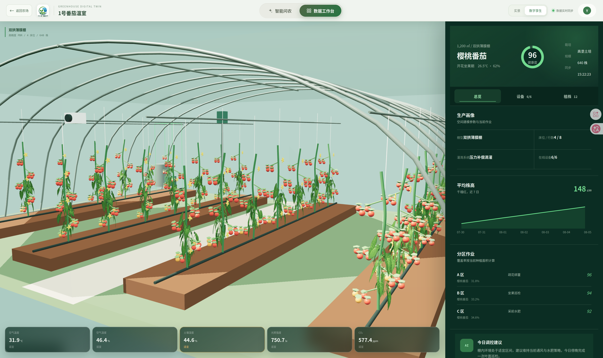
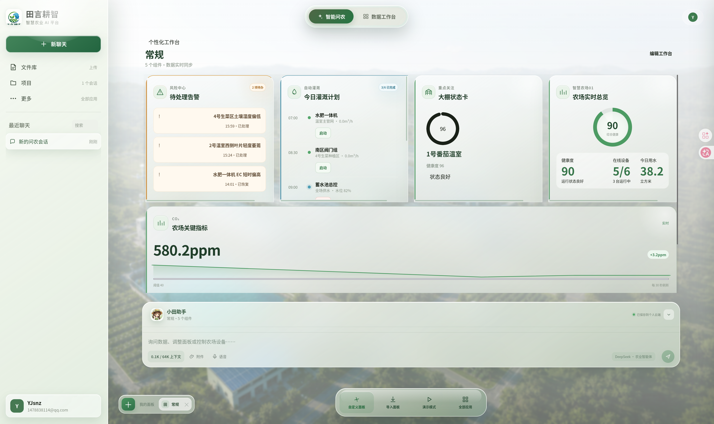
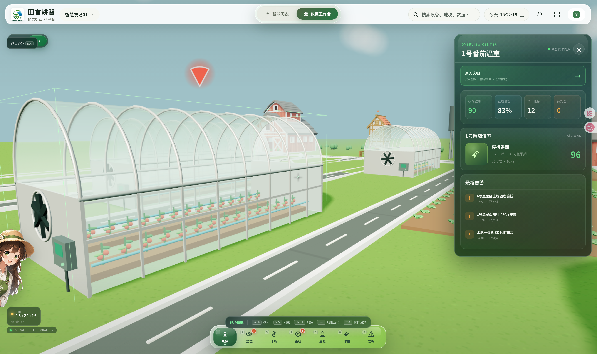
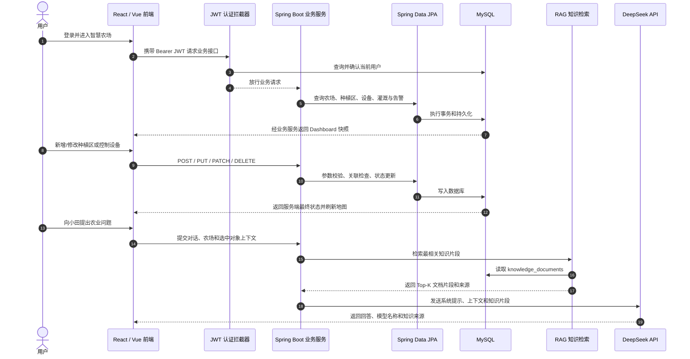

# 田言耕智 · AI 原生智慧农业与数字孪生平台

田言耕智是一套面向智慧农场、设施农业和农业机器人场景的全栈平台。项目将农场官网、账号认证、航拍实景、Three.js 数字孪生、温室内部建模、设备与灌溉控制、告警处理、监控识别和 AI 问农整合在同一套系统中。

当前仓库可以运行完整演示：用户从官网注册或登录后进入“智慧农场01”，在航拍和 3D 场景中查看农场对象，进入六座差异化温室，操作设备和灌溉，并使用 DeepSeek 驱动的农业助手。项目目前使用虚拟传感器数据和演示视频；LingBot-Map 单目建图、机器人导航、在线边缘推理和 NVIDIA LocateAnything 属于后续规划。

> 默认访问地址：`http://localhost:8081/`

## 项目界面

### 官网与平台入口


官网提供产品、解决方案、数字孪生、关于我们、联系我们、登录和平台入口。

### 航拍实景数据工作台


航拍场景将温室、地块、设备、水池、气象站、摄像头和农业机器人映射为可交互空间对象。选中对象后，右侧抽屉展示对应详情和业务操作。

### Three.js 数字孪生


3D 场景支持鸟瞰、对象拾取、详情联动和第一人称巡场。单击大棚打开详情，点击“进入大棚”或双击大棚模型可进入对应温室内部。

### 大棚内部数字孪生



六座温室分别使用番茄、草莓、黄瓜、育苗、生态番茄和水培叶菜模型，并具有独立栽培方式、植株、区域、设备和环境数据。

### AI 问农与自定义工作台




智能问农支持多轮对话、快捷问题和农场上下文；自定义工作台可组合告警、灌溉计划、大棚状态、农场总览和关键指标组件。

## 当前实现状态

| 能力 | 状态 | 说明 |
|---|---|---|
| 官网与联系表单 | 已实现 | React 官网，联系信息发送至项目邮箱 |
| 邮箱密码注册和登录 | 已实现 | BCrypt 密码散列、JWT 会话 |
| 摄像头刷脸登录 | 已实现 | 对接百度人脸服务；登录仅允许实时摄像头采集，不允许上传图片 |
| 航拍实景工作台 | 已实现 | 可交互热区、空间标签、搜索、测距和图层控制 |
| 3D 数字孪生 | 已实现 | Three.js 鸟瞰、第一人称、碰撞和对象拾取 |
| 七个业务中心 | 已实现 | 总览、监控、环境、设备、灌溉、作物、告警 |
| 设备与灌溉控制 | 已实现 | 后端接口和 MySQL 持久化 |
| AI 问农 | 已实现 | Spring Boot 代理 DeepSeek，密钥不进入浏览器 |
| 温室内部 | 已实现 | 六座差异化大棚、设备、分区、植株和右侧数据栏 |
| 监控识别 | 已实现演示链路 | YOLO + ByteTrack 离线推理，逐帧 JSON 与视频同步展示 |
| LingBot-Map 单目建图 | 规划中 | 视频/图片流三维重建、点云和相机轨迹 |
| 农业机器人导航 | 规划中 | 点云转 OccupancyGrid、TF、Nav2 和安全控制 |
| 在线视觉推理 | 规划中 | RTSP、边缘 YOLO、消息总线和 WebSocket/SSE |
| NVIDIA LocateAnything | 规划中 | 开放词汇定位和疑难帧复核 |
| 多租户与生产高可用 | 规划中 | 租户隔离、对象存储、可观测性、灾备和高可用 |

## 核心功能

### 官网和身份认证

- 响应式产品官网与独立营销页面；
- 联系表单；
- 邮箱注册、密码登录和登录保持；
- 注册后可选人脸绑定；
- 摄像头刷脸登录和人脸解绑；
- 未登录或 JWT 失效时自动返回登录页。


### 农场数据工作台

- 实景与 3D 模式共享对象 ID 和选中状态；
- 搜索温室、地块、摄像头、设备和水利设施；
- 对象 Hover、单击、双击和详情抽屉；
- 总览、监控、环境、设备、灌溉、作物和告警 Dock；
- 环境趋势、设备开关、自检、灌溉时长和告警处理；
- 桌面、平板和移动端响应式布局。

### 3D 与第一人称巡场

- 本地加载 GLB 模型，不依赖运行时第三方模型 CDN；
- 温室、道路、地块、水池、风机、控制柜、机器人等场景对象；
- 重复作物使用 `InstancedMesh` 批量渲染；
- 昼夜光照、晨昏色温、星空和云层；
- `W/A/S/D` 移动、鼠标观察、`Shift` 加速、准星选择；
- `1–7` 切换七个业务模块，`Esc` 退出；
- 温室、建筑、设备、种植区和水池碰撞范围。



### 大棚内部

- 从详情按钮或双击 3D 大棚进入；
- 实景视频与数字孪生切换；
- 温室骨架、苗床/高垄、灌溉管、传感器、风机和控制设备；
- 六种差异化作物和栽培结构；
- 温度、湿度、基质含水、光照和 CO₂；
- 总览、设备和植株三级数据；
- 样本植株点击定位与健康指标；
- 可收起、可独立滚动的右侧数据栏。

### AI 问农

- 数据工作台中的“小田”助手；
- 独立智能问农页面；
- 当前农场、业务模块和选中对象上下文；
- 多轮对话与快捷农业问题；
- 用户独立的聊天和工作台状态；
- DeepSeek API 由后端调用，前端不保存模型密钥。

### YOLO 监控识别

当前监控链路不是浏览器实时推理：

```text
演示视频 → 抽帧与标注 → YOLO11n 训练
        → YOLO + ByteTrack 离线分析
        → 逐帧 detections.json
        → Vue 按视频时间绘制检测框
```

目前类别为 `person` 和 `crop`。现有 38 帧主要用于演示视频拟合，不能代表对任意温室的泛化能力。训练、标注和导出流程见 [YOLO 接入说明](tools/yolo/README.md)。

## 系统架构

```mermaid
flowchart TB
    USER([农场管理人员 / 运维人员 / 访客])

    subgraph CLIENT[浏览器客户端]
        direction LR
        subgraph LANDING[React 官网]
            HOME[产品与解决方案]
            ACCOUNT[注册 / 密码登录 / 人脸登录]
            DOCS[用户手册 / 技术手册]
            CONTACT[联系表单]
        end

        subgraph PLATFORM[Vue 智慧农业平台]
            WORKSPACE[航拍实景工作台]
            MODULES[总览 / 监控 / 环境 / 设备<br/>灌溉 / 作物 / 告警]
            ASSISTANT[智能问农 / 自定义工作台]
            GREENHOUSE[六座温室内部]
        end

        subgraph DIGITAL_TWIN[Three.js 数字孪生]
            FARM3D[农场 3D 鸟瞰]
            FPS[第一人称巡场]
            GH3D[温室内部建模]
        end
    end

    USER --> HOME
    USER --> WORKSPACE
    WORKSPACE <--> FARM3D
    FARM3D <--> FPS
    GREENHOUSE <--> GH3D
    WORKSPACE --> MODULES

    subgraph SERVER[Java 17 / Spring Boot 4.1]
        direction LR
        STATIC[静态资源托管<br/>官网与 platform]
        AUTH[认证服务<br/>JWT / BCrypt / 人脸]
        DASHBOARD[农场业务服务<br/>资产 / 种植区 / 设备 / 灌溉 / 告警]
        SIMULATOR[虚拟传感器<br/>30 秒定时更新 / 阈值判断]
        AI[AI 助手服务<br/>上下文组装 / DeepSeek 代理]
        RAG[RAG 知识检索<br/>文档切片 / 关键词与双字词召回]
        STATE[用户状态服务<br/>对话 / 自定义工作台]
        JPA[Spring Data JPA<br/>事务与数据访问]
    end

    HOME -->|HTTP / HTTPS| STATIC
    ACCOUNT -->|REST API| AUTH
    WORKSPACE -->|REST API + Bearer JWT| AUTH
    WORKSPACE --> DASHBOARD
    ASSISTANT --> AI
    ASSISTANT --> STATE
    DASHBOARD <--> SIMULATOR
    AI <--> RAG
    AUTH --> JPA
    DASHBOARD --> JPA
    RAG --> JPA
    STATE --> JPA

    subgraph DATA[MySQL 8.4]
        USERS[(users)]
        FARM[(farm_assets<br/>farm_devices<br/>environment_metrics)]
        CONTROL[(irrigation_units<br/>farm_alerts<br/>metric_thresholds)]
        KNOWLEDGE[(knowledge_documents<br/>user_assistant_states)]
    end

    JPA --> USERS
    JPA --> FARM
    JPA --> CONTROL
    JPA --> KNOWLEDGE

    subgraph EXTERNAL[外部服务]
        DEEPSEEK[DeepSeek Chat API]
        FACE[百度智能云人脸 API]
        FORMSUBMIT[FormSubmit 邮件服务]
    end

    AI --> DEEPSEEK
    AUTH --> FACE
    CONTACT --> FORMSUBMIT

    subgraph VISION[当前离线视觉演示链路]
        VIDEO[温室演示视频]
        YOLO[Python / Ultralytics YOLO11n]
        TRACK[ByteTrack 目标跟踪]
        JSON[逐帧 detections.json]
    end

    VIDEO --> YOLO --> TRACK --> JSON --> MODULES

    subgraph PLANNED[规划中的边缘与机器人能力]
        CAMERA[RTSP / 单目摄像头]
        EDGE[边缘 YOLO / TensorRT]
        MAP[LingBot-Map 三维重建]
        MQ[MQTT / 事件总线 / WebSocket]
        ROS[ROS 2 / Nav2 / 农业机器人]
        OBJECT[(S3 对象存储)]
    end

    CAMERA -.规划.-> EDGE
    CAMERA -.规划.-> MAP
    EDGE -.规划.-> MQ
    MAP -.规划.-> OBJECT
    MAP -.审核后发布.-> ROS
    MQ -.规划.-> DASHBOARD

    classDef client fill:#e8f5ec,stroke:#31834b,color:#173b24
    classDef service fill:#e8f2f5,stroke:#347d91,color:#153943
    classDef database fill:#fff5dc,stroke:#ad7921,color:#4d350d
    classDef external fill:#f3edff,stroke:#7854ad,color:#382655
    classDef planned fill:#f5f5f5,stroke:#8b8b8b,color:#555,stroke-dasharray:5 4
    class HOME,ACCOUNT,DOCS,CONTACT,WORKSPACE,MODULES,ASSISTANT,GREENHOUSE,FARM3D,FPS,GH3D client
    class STATIC,AUTH,DASHBOARD,SIMULATOR,AI,RAG,STATE,JPA,VIDEO,YOLO,TRACK,JSON service
    class USERS,FARM,CONTROL,KNOWLEDGE database
    class DEEPSEEK,FACE,FORMSUBMIT external
    class CAMERA,EDGE,MAP,MQ,ROS,OBJECT planned
```



图中实线表示当前仓库已经实现并可运行的链路，虚线表示规划接入能力。当前监控识别采用离线推理结果与视频同步展示；LingBot-Map、实时边缘推理、消息总线和 ROS 2/Nav2 尚未接入生产链路。

### 核心业务数据流



Spring Boot 单进程托管两套前端：

| 应用 | 路径 | 技术 | 源码 | 构建输出 |
|---|---|---|---|---|
| 官网和认证 | `/`、`/#/...` | React 18、Vite、Tailwind | `landing/` | `src/main/resources/static/` |
| 智慧农业平台 | `/platform/` | Vue 3、TypeScript、Three.js | `frontend/` | `src/main/resources/static/platform/` |
| REST API | `/api/...` | Java 17、Spring Boot 4.1 | `src/main/java/` | Spring Boot 应用 |

## 技术栈

### 官网与文档

| 技术 | 版本 | 项目用途 |
|---|---:|---|
| React | 18.2.0 | 官网、登录注册、联系表单和在线文档页面 |
| React DOM | 18.2.0 | React 页面挂载与浏览器渲染 |
| React Router DOM | 6.3.0 | 官网 Hash 路由、认证页和文档动态路由 |
| Tailwind CSS | 3.2.4 | 官网响应式布局、颜色、间距和组件样式 |
| Lucide React | 0.263.1 | 官网统一线性图标 |
| Marked | 4.3.x | 将用户手册和技术手册 Markdown 渲染为在线文档 |
| Vite / React Plugin | 2.9.16 / 1.3.2 | 官网开发服务器、资源处理和生产构建 |
| PostCSS / Autoprefixer | 8.4.21 / 10.4.13 | CSS 转换和浏览器前缀兼容 |
| FormSubmit | 外部服务 | 将官网联系表单转发到指定邮箱 |

### 智慧农业平台

| 技术 | 版本 | 项目用途 |
|---|---:|---|
| Vue | 3.2.47 | 数据工作台、智能问农、温室内部和业务抽屉 |
| TypeScript | 4.9.5 | 前端类型约束、API DTO 和场景对象建模 |
| Pinia | 2.0.36 | 当前农场、选择对象、业务模块、图层和同步状态管理 |
| Vue Router | 4.1.6 | 工作台、智能问农和温室详情路由 |
| ECharts | 5.4.3 | 环境趋势和业务数据图表 |
| Sass / SCSS | 1.58.3 | 平台组件样式、响应式布局和视觉效果 |
| Tailwind CSS / DaisyUI | 3.2.x / 2.51.x | 通用工具类和基础 UI 组件 |
| Vue TSC | 1.2.0 | Vue 单文件组件 TypeScript 类型检查 |
| Vite / Vue Plugin | 2.9.16 / 2.3.4 | 平台开发服务器和生产资源构建 |

### 三维数字孪生与媒体

| 技术 | 版本 | 项目用途 |
|---|---:|---|
| Three.js | 0.152.2 | 农场鸟瞰、第一人称巡场和温室内部数字孪生 |
| WebGL | 浏览器能力 | GPU 实时三维渲染 |
| GLTF / GLB | 3D 资源格式 | 本地加载温室、设备、车辆和农业场景模型 |
| OrbitControls | Three.js 扩展 | 三维鸟瞰旋转、缩放和平移 |
| PointerLockControls | Three.js 扩展 | 第一人称鼠标视角和巡场控制 |
| Raycaster | Three.js 核心 | 三维对象拾取、悬停、单击和双击交互 |
| InstancedMesh | Three.js 核心 | 批量渲染重复植株和树木，减少 Draw Call |
| HTML5 Video / Canvas | 浏览器能力 | 温室实景视频播放和 YOLO 检测框同步叠加 |

### 后端与 API

| 技术 | 版本 | 项目用途 |
|---|---:|---|
| Java | 17 | 后端主要编程语言和 Java HTTP Client 运行环境 |
| Spring Boot | 4.1.0 | 应用启动、配置管理、依赖装配和静态资源托管 |
| Spring Web MVC | 随 Spring Boot | REST Controller、JSON API、拦截器和异常响应 |
| Spring Data JPA | 随 Spring Boot | Repository 数据访问、实体映射和事务持久化 |
| Hibernate ORM | 随 Spring Boot | JPA 实现和本地演示环境自动建表更新 |
| Jakarta Validation | 随 Spring Boot | 注册、设备、种植区、阈值和控制参数校验 |
| Jakarta Persistence | 随 Spring Boot | `@Entity`、`@Table` 和字段约束映射 |
| Java HttpClient | JDK 17 | 服务端调用 DeepSeek 和百度人脸 HTTP API |
| Spring Scheduling | 随 Spring Boot | 每 30 秒生成虚拟传感器数据并执行阈值判断 |
| Lombok | 随 Spring Boot 依赖管理 | Entity、Service 和 DTO 样板代码生成 |
| Maven Wrapper | 项目内置 | 后端依赖、编译、测试、打包和启动 |

### 数据库与持久化

| 技术 | 版本 | 项目用途 |
|---|---:|---|
| MySQL | 8.4 | 用户、农场资产、种植区、设备、环境、灌溉、告警和知识库 |
| MySQL Connector/J | 随 Spring Boot | JDBC 数据库连接驱动 |
| HikariCP | 随 Spring Boot | JDBC 数据库连接池 |
| Hibernate `ddl-auto=update` | 当前 Demo 配置 | 开发环境根据实体自动补充表结构；生产建议改用 Flyway/Liquibase |
| Docker Volume | Docker 能力 | 保存 MySQL 数据，容器重建或服务重启后数据仍保留 |

当前主要数据表：

```text
users                      用户、密码哈希与人脸绑定
farm_assets                温室、地块和种植区空间资产
farm_devices               设备资料、在线状态与控制状态
environment_metrics        温度、湿度、光照和 CO₂ 指标
irrigation_units           灌溉单元、时长与流量
farm_alerts                告警、级别、状态和处置结果
metric_thresholds          土壤湿度等指标阈值
knowledge_documents        RAG 知识文档
user_assistant_states      用户对话与自定义工作台状态
```

### 身份认证与安全

| 技术 | 版本 | 项目用途 |
|---|---:|---|
| JJWT | 0.12.6 | 生成、解析和校验 Bearer JWT |
| BCrypt | Spring Security Crypto | 密码单向散列和登录密码验证 |
| Spring MVC HandlerInterceptor | 随 Spring Boot | 保护 `/api/**` 业务接口并注入当前用户 |
| 百度智能云人脸 API | 外部服务 | 人脸注册、人脸库检索、刷脸登录和解绑 |
| MediaDevices API | 浏览器能力 | 从实时摄像头采集登录人脸，不开放图片上传入口 |
| `.env.local` / 环境变量 | 运行配置 | 隔离数据库密码、JWT、DeepSeek Key 和百度 AK/SK |

项目只引入 `spring-security-crypto` 进行 BCrypt 散列，没有启用完整 Spring Security Filter Chain；JWT 认证由项目自己的 MVC 拦截器完成。

### AI 智能问农与 RAG

| 技术 | 状态 | 项目用途 |
|---|---|---|
| DeepSeek 兼容 Chat API | 已接入 | 多轮农业问答、农场上下文分析和管理建议 |
| 服务端 Prompt 组装 | 已实现 | 注入当前农场、业务模块、选择对象和知识片段 |
| 文档分块 | 已实现 | 约 520 字切片、80 字重叠，保持上下文连续性 |
| 中文双字词与关键词召回 | 已实现 | 对知识片段进行轻量相关度评分并选择 Top-K |
| MySQL 知识库 | 已实现 | 保存、更新、查询和删除 `knowledge_documents` |
| 向量 Embedding / 向量数据库 | 未接入 | 文档规模扩大后可升级为 pgvector、Milvus 或 Elasticsearch |

### 计算机视觉与算法工具

| 技术 | 版本/状态 | 项目用途 |
|---|---:|---|
| Python | 算法运行环境 | 抽帧、数据转换、模型训练和检测结果导出 |
| Ultralytics YOLO | 8.3～8.x | `person`、`crop` 类别训练和离线视频检测 |
| ByteTrack | Ultralytics 集成 | 跨帧目标 ID 跟踪 |
| OpenCV Python | 4.8～4.x | 视频读取、抽帧和图像处理 |
| PyYAML | 6.x | YOLO 数据集和训练配置解析 |
| LAP | 0.5.x | ByteTrack 线性分配依赖 |
| LabelMe → YOLO 工具 | 项目脚本 | 将标注转换为 YOLO 数据集格式 |
| detections.json | 项目数据格式 | 将逐帧框、类别、置信度和跟踪 ID 提供给 Vue |
| TensorRT | 规划中 | 后续边缘 GPU 实时推理加速 |
| NVIDIA LocateAnything | 规划中 | 开放词汇定位和低置信度疑难帧复核 |
| LingBot-Map | 规划中 | 单目视频三维重建、相机轨迹和点云生成 |
| ROS 2 / Nav2 | 规划中 | 农业机器人定位、路径规划和安全控制 |

### 测试、构建与部署

| 技术 | 项目用途 |
|---|---|
| JUnit 5 | Java 单元测试和集成测试执行 |
| Spring Boot Test | 启动真实 Spring 上下文验证服务、JPA 和配置 |
| MockMvc | 测试注册登录、Dashboard、设备、灌溉、告警、RAG 和种植区 API |
| Maven Surefire | 汇总并执行后端测试 |
| Vue TSC | 在构建前拦截 Vue/TypeScript 类型错误 |
| Vite Production Build | 分别构建 React 官网与 Vue 平台 |
| Docker / MySQL 8.4 Image | 创建本地 MySQL 服务和持久化数据卷 |
| Bash | `setup-mysql.sh` 初始化数据库，`start.sh` 构建并启动完整系统 |
| Spring Boot Static Resources | 同一进程托管 `/` 官网和 `/platform/` 数据平台 |
| Git / GitHub | 版本管理、分支协作、推送和 Pull Request |

### 规划中的生产基础设施

以下技术已经写入演进方案，但当前仓库尚未形成可运行生产链路：

| 技术 | 计划用途 |
|---|---|
| MQTT / 事件总线 | 接收真实传感器、设备和边缘识别事件 |
| WebSocket / SSE | 向浏览器实时推送环境、告警和识别结果 |
| S3 兼容对象存储 | 保存视频、模型、点云、地图和大文件产物 |
| Redis | 会话、缓存、限流和短期任务状态 |
| Flyway / Liquibase | 生产数据库版本迁移和回滚 |
| OpenTelemetry | 日志、指标和分布式链路追踪 |
| CI/CD | 自动执行测试、前端构建、镜像发布和部署 |
| Kubernetes / 高可用 MySQL | 多实例部署、扩缩容、故障恢复和灾备 |

## 使用的开源项目与资源

下表汇总当前代码、构建链路和算法工具直接使用的主要开源项目。许可证名称用于快速审计，正式发布或商用前仍应以锁定版本随附的 `LICENSE`、模型权重条款和数据集授权为准。

| 开源项目 | 许可证/授权 | 在本项目中的用途 | 项目地址 |
|---|---|---|---|
| React / React DOM | MIT | 官网、认证页和在线文档 | [facebook/react](https://github.com/facebook/react) |
| React Router | MIT | 官网与文档路由 | [remix-run/react-router](https://github.com/remix-run/react-router) |
| Vue.js | MIT | 智慧农业平台界面 | [vuejs/core](https://github.com/vuejs/core) |
| Vue Router | MIT | 平台页面路由 | [vuejs/router](https://github.com/vuejs/router) |
| Pinia | MIT | Vue 全局业务状态 | [vuejs/pinia](https://github.com/vuejs/pinia) |
| Apache ECharts | Apache-2.0 | 环境和业务数据图表 | [apache/echarts](https://github.com/apache/echarts) |
| Three.js | MIT | 农场和温室数字孪生 | [mrdoob/three.js](https://github.com/mrdoob/three.js) |
| Vite | MIT | React/Vue 开发服务器和构建 | [vitejs/vite](https://github.com/vitejs/vite) |
| TypeScript | Apache-2.0 | Vue 平台静态类型检查 | [microsoft/TypeScript](https://github.com/microsoft/TypeScript) |
| Tailwind CSS | MIT | 官网和平台工具样式 | [tailwindlabs/tailwindcss](https://github.com/tailwindlabs/tailwindcss) |
| DaisyUI | MIT | Vue 平台基础组件样式 | [saadeghi/daisyui](https://github.com/saadeghi/daisyui) |
| Sass | MIT | Vue 组件 SCSS 编译 | [sass/dart-sass](https://github.com/sass/dart-sass) |
| Lucide | ISC | 官网统一图标 | [lucide-icons/lucide](https://github.com/lucide-icons/lucide) |
| Marked | MIT | 官网 Markdown 文档渲染 | [markedjs/marked](https://github.com/markedjs/marked) |
| Spring Boot / Spring Framework | Apache-2.0 | 后端应用、Web MVC、JPA 和测试基础 | [spring-projects/spring-boot](https://github.com/spring-projects/spring-boot) |
| Hibernate ORM | LGPL-2.1 | JPA 实现、实体映射和 SQL 生成 | [hibernate/hibernate-orm](https://github.com/hibernate/hibernate-orm) |
| JJWT | Apache-2.0 | JWT 签发、解析和校验 | [jwtk/jjwt](https://github.com/jwtk/jjwt) |
| Project Lombok | MIT | Java 构造器、Getter/Setter 和 Builder 生成 | [projectlombok/lombok](https://github.com/projectlombok/lombok) |
| MySQL Community Server | GPL-2.0 | 本地 Demo 关系型数据库 | [mysql/mysql-server](https://github.com/mysql/mysql-server) |
| MySQL Connector/J | GPL-2.0 with FOSS Exception | Spring Boot JDBC 驱动 | [mysql/mysql-connector-j](https://github.com/mysql/mysql-connector-j) |
| Ultralytics | AGPL-3.0 / 企业许可双轨 | YOLO11n 训练、检测和 ByteTrack 调用 | [ultralytics/ultralytics](https://github.com/ultralytics/ultralytics) |
| OpenCV | Apache-2.0 | 视频读取、抽帧和图像处理 | [opencv/opencv](https://github.com/opencv/opencv) |
| PyYAML | MIT | YOLO 数据集和训练配置解析 | [yaml/pyyaml](https://github.com/yaml/pyyaml) |
| LAP | BSD-2-Clause | ByteTrack 目标匹配计算 | [gatagat/lap](https://github.com/gatagat/lap) |
| Quaternius 农业 3D 模型 | CC0 1.0 | 农场建筑、作物、筒仓和车辆模型 | [模型许可清单](frontend/public/assets/models/LICENSES.md) |

### 外部服务与开源项目的边界

- DeepSeek Chat API、百度智能云人脸 API 和 FormSubmit 是外部服务，不等同于本仓库的开源依赖；使用时需分别遵守服务协议、隐私政策和计费规则。
- Ultralytics 默认开源许可证为 AGPL-3.0；闭源商用、SaaS 或设备交付前应评估其传染性条款或取得合适的企业许可。
- 当前 GLB 农业模型为 CC0 资源，详细文件、原作者和来源记录在[模型许可清单](frontend/public/assets/models/LICENSES.md)中。
- LingBot-Map、NVIDIA LocateAnything、ROS 2/Nav2、TensorRT 等仍为规划能力；正式引入前必须分别审核代码许可证、模型权重许可证、数据集授权和商用限制。

## 开发过程中使用的 Codex Skills

Skill 是 Codex 开发环境中的任务工作流说明，用于规范分析、设计、验证和发布过程。它们不是应用运行依赖，不会被 Spring Boot、React 或 Vue 加载，也不会随生产包运行。

| Skill | 来源 | 本项目中的作用 | 是否属于运行依赖 |
|---|---|---|---|
| `impeccable` 4.0.4 | 项目本地开发 Skill | 官网导航、文档中心、设备/种植区表单、错误状态、响应式和可访问性检查 | 否 |
| `github:yeet` | Codex GitHub 插件 | 核对提交范围、排除本地工具目录、提交、推送和创建 PR | 否 |
| Codex 文件与终端工作流 | Codex 开发环境 | 检查仓库、修改代码、运行 Maven/npm 构建和测试 | 否 |

其中 `.agents/` 保存本地 Skill 与设计辅助文件，当前被明确排除在业务代码提交之外。团队成员即使没有安装这些 Skill，也可以正常构建、运行和部署本项目；只需要 README 中列出的 Java、Node.js、Docker 和可选第三方 API 配置。

## 项目目录

```text
ty/
├── landing/                         React 官网与认证源码
├── frontend/                        Vue 数据平台与 Three.js 场景
│   ├── public/assets/models/        本地 3D 模型
│   └── public/assets/media/         视频和检测结果
├── src/main/java/com/example/ty/
│   ├── auth/                        用户、JWT 和人脸认证
│   ├── dashboard/                   农场、温室、设备和告警
│   └── assistant/                   AI 问农与用户状态
├── src/main/resources/
│   ├── application.yaml             后端配置
│   └── static/                      两套前端构建产物
├── src/test/                        后端集成测试
├── tools/yolo/                      数据、训练和检测导出工具
├── docs/
│   ├── 截图/                        当前版本截图
│   ├── 用户使用手册.md
│   └── 技术说明手册.md
├── setup-mysql.sh                   初始化 Docker MySQL
├── start.sh                         构建并启动完整系统
└── pom.xml
```

## 快速开始

### 环境要求

- JDK 17；
- Docker 与 Docker Engine/Docker Desktop；
- Node.js 和 npm；
- 支持 WebGL 的现代浏览器；
- 可选：DeepSeek API Key、百度人脸 API Key。

项目当前前端依赖已固定到兼容版本，可在 Node 12 环境构建；新部署建议优先使用维护中的 Node LTS，并在升级依赖前执行完整回归。

### 一键启动完整 Demo

首次部署：

```bash
chmod +x setup-mysql.sh start.sh mvnw
./setup-mysql.sh
./start.sh
```

脚本将：

1. 创建或启动 `mysql:8.4` 容器；
2. 创建 `tianyan` 数据库和持久化卷；
3. 安装缺失的前端依赖；
4. 构建 React 官网；
5. 构建 Vue 平台；
6. 启动 Spring Boot。

启动完成后访问：

```text
http://localhost:8081/
```

按 `Ctrl+C` 停止 Spring Boot。MySQL 容器会继续运行。后续启动只需要：

```bash
./start.sh
```

已构建前端且只修改 Java 时：

```bash
./start.sh --skip-build
```

### 本机私密配置

```bash
cp .env.example .env.local
```

编辑 `.env.local`：

```dotenv
JWT_SECRET=至少32字节的随机密钥
DEEPSEEK_API_KEY=你的DeepSeekKey
DEEPSEEK_BASE_URL=https://api.deepseek.com
DEEPSEEK_MODEL=deepseek-v4-flash
BAIDU_FACE_AK=你的百度人脸AccessKey
BAIDU_FACE_SK=你的百度人脸SecretKey
```

`.env.local` 已被 Git 忽略。不要把真实数据库密码、JWT、模型 Key 或人脸 Key 写进仓库。

### 数据库配置

默认值：

```text
容器名：mysql
镜像：mysql:8.4
数据库：tianyan
地址：localhost:3306
用户名：root
密码：Root_123456
数据卷：tianyan-mysql-data
```

可通过以下变量覆盖：

```text
MYSQL_CONTAINER  MYSQL_IMAGE  MYSQL_VOLUME
DB_URL           DB_NAME      DB_USERNAME      DB_PASSWORD
SERVER_PORT
```

默认凭据只适合本地演示。生产环境必须建立最小权限数据库账号并使用 Secret 管理。

## 分别开发前端

### Vue 数据平台

```bash
cd frontend
npm install
npm run dev
```

开发地址：`http://localhost:5173/platform/`

类型检查和正式构建：

```bash
npm run typecheck
npm run build
```

构建输出写入 `src/main/resources/static/platform/`。

### React 官网

```bash
cd landing
npm install
npm run dev
```

开发地址：`http://localhost:5174/`

正式构建：

```bash
npm run build
```

构建输出写入 `src/main/resources/static/` 根目录。

## 后端运行与测试

仅启动后端：

```bash
./mvnw spring-boot:run
```

运行测试：

```bash
./mvnw test
```

集成测试需要 MySQL 正常运行。若出现 `Communications link failure`，请先执行：

```bash
./setup-mysql.sh
```

## 主要接口

### 认证

```text
POST /api/auth/register
POST /api/auth/login
GET  /api/auth/me
POST /api/auth/face-register
POST /api/auth/face-delete
POST /api/auth/face-login
```

### 农场与温室

```text
GET   /api/farms/{farmId}/dashboard
GET   /api/farms/{farmId}/greenhouses/{greenhouseId}
PATCH /api/farms/{farmId}/devices/{entityId}
POST  /api/farms/{farmId}/devices/{entityId}/self-test
PATCH /api/farms/{farmId}/irrigation/{unitId}
PATCH /api/farms/{farmId}/alerts/{alertId}/handle
```

### AI 助手

```text
POST /api/assistant/chat
GET  /api/assistant/state
PUT  /api/assistant/state
```

除公开认证接口外，业务接口需要：

```http
Authorization: Bearer <JWT>
```

详细请求、响应和数据模型见[技术说明手册](docs/技术说明手册.md)。

## 数据持久化

主要数据表：

```text
users
farm_assets
farm_devices
environment_metrics
irrigation_units
farm_alerts
user_assistant_states
```

系统首次启动会初始化“智慧农场01”演示数据。环境指标会周期更新；设备、灌溉和告警操作写入 MySQL，刷新页面后仍保留。

## 后续规划

### 1. LingBot-Map 单目实景建图

计划使用 [LingBot-Map](https://github.com/robbyant/lingbot-map) 处理单目摄像头视频或图片流，输出相机轨迹和带颜色点云。目标是在不依赖激光雷达的前提下完成温室实景三维重建，并向网页实景模型和机器人地图提供基础数据。

规划链路：

```text
单目摄像头 → 视频采集与相机标定 → LingBot-Map
           → 相机轨迹与点云 → 去噪、尺度恢复、地面分割
           → GLB/分块点云网页展示
```

LingBot-Map 是三维重建模型，不是完整导航栈。单目方案仍会受到尺度漂移、弱纹理、棚膜反光、重复棚架、人员移动和光照变化影响。

### 2. 机器人占据地图与导航

经过审核的重建点云将转换为二维占据栅格或三维体素地图，并建立：

```text
map → odom → base_link → camera_link
```

计划接入 ROS 2/Nav2 的静态层、实时障碍层、体素层、膨胀层、禁行区和限速区。视觉重建不能替代实时避障；机器人仍需轮速/视觉里程计、IMU、碰撞保护、急停、失联停车和人工接管。

### 3. 在线视觉识别

```text
RTSP 摄像头 → 边缘解码 → YOLO/TensorRT → ByteTrack
           → MQTT/事件总线 → Spring Boot
           → WebSocket/SSE → 浏览器实时叠加与告警
```

边缘节点在断网期间继续执行本地规则并缓存事件，网络恢复后补传。视频流、推理和业务服务分离，避免在 Spring JVM 内执行逐帧 GPU 推理。

### 4. NVIDIA LocateAnything

设备条件允许时，计划引入 [NVIDIA LocateAnything](https://research.nvidia.com/labs/lpr/locate-anything/) 进行开放词汇定位。它作为 YOLO 的二级模型，用于临时自然语言查询、低置信度复核和新类别数据挖掘，而不是直接替换 7×24 小时实时 YOLO。

例如：

- 定位叶片明显萎蔫的番茄植株；
- 定位通道积水区域；
- 定位破损的滴灌管；
- 定位未佩戴防护装备的人员。

任何农业查询都需要本地标注数据验证，不能直接沿用通用数据集指标。

### 5. 生产化平台

- `tenant_id` 全链路多租户隔离；
- S3 兼容对象存储保存视频、点云、地图和模型；
- OpenTelemetry 日志、指标和链路追踪；
- Spring Boot 多实例、MySQL 高可用、持久消息集群；
- GPU Worker 任务队列、灰度模型发布和失败回滚；
- RPO/RTO、跨区域备份和恢复演练。

完整实施步骤、API、消息格式、坐标转换、验收指标和阶段里程碑见[技术说明手册第21—27章](docs/技术说明手册.md#21-五项规划的工程实施蓝图)。

## 安全与使用边界

- 当前项目用于开发、展示和方案验证，不应未经安全改造直接控制真实生产设备；
- 刷脸涉及敏感个人信息，正式部署前需取得单独授权并提供删除机制；
- 摄像头采集限制不能替代活体检测；
- AI 农业建议需要专业人员结合现场确认；
- 地图和视觉模型输出不得绕过安全控制直接驱动机器人；
- 生产环境必须启用 HTTPS、限流、审计、密钥轮换和最小权限。

## 3D 模型和许可证

本地公模位于 `frontend/public/assets/models/`。当前部分模型来自 Quaternius，经 Poly Pizza 提供 GLTF 下载，使用 CC0 1.0。完整来源与许可见：

[frontend/public/assets/models/LICENSES.md](frontend/public/assets/models/LICENSES.md)

引入 LingBot-Map、LocateAnything、模型权重或其他数据集前，应分别复核代码、权重、数据和商用许可证。

## 项目文档

- [用户使用手册](docs/用户使用手册.md)：从官网、注册登录到工作台、温室、设备、灌溉和问农的逐步操作；
- [技术说明手册](docs/技术说明手册.md)：架构、配置、API、数据模型、算法、建图、导航和生产化规划；
- [完整方案 V3.1](docs/田言耕智_AI原生智慧农业平台完整方案_V3.1_大棚数字孪生升级版.md)：产品与业务整体方案；
- [Windows + Docker Desktop 部署手册](docs/Windows_DockerDesktop部署手册.md)；
- [Git 团队协作手册（Windows）](docs/Git团队协作手册_Windows.md)；
- [YOLO 接入说明](tools/yolo/README.md)。

## 演示建议

推荐按以下顺序体验：

1. 打开官网并进入登录页；
2. 注册账号或使用密码登录；
3. 在航拍实景中选择温室并查看右侧详情；
4. 切换 3D 并进入第一人称巡场；
5. 使用数字键切换七个业务模块；
6. 双击大棚进入棚内数字孪生；
7. 查看设备、分区和样本植株；
8. 返回“智能问农”，查询当前农场异常和灌溉建议；
9. 打开自定义工作台组合业务面板。

更完整的操作步骤和截图说明请阅读[用户使用手册](docs/用户使用手册.md)。
