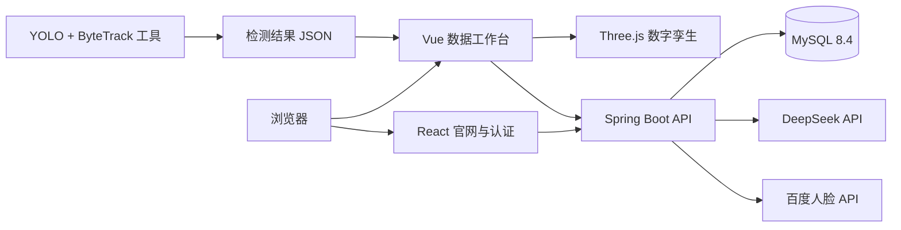

# 田言耕智 · AI 原生智慧农业与数字孪生平台

田言耕智是一套面向智慧农场、设施农业和农业机器人场景的全栈平台。项目将农场官网、账号认证、航拍实景、Three.js 数字孪生、温室内部建模、设备与灌溉控制、告警处理、监控识别和 AI 问农整合在同一套系统中。

当前仓库可以运行完整演示：用户从官网注册或登录后进入“智慧农场01”，在航拍和 3D 场景中查看农场对象，进入六座差异化温室，操作设备和灌溉，并使用 DeepSeek 驱动的农业助手。项目目前使用虚拟传感器数据和演示视频；LingBot-Map 单目建图、机器人导航、在线边缘推理和 NVIDIA LocateAnything 属于后续规划。

> 默认访问地址：`http://localhost:8081/`

## 项目界面

### 官网与平台入口


官网提供产品、解决方案、数字孪生、关于我们、联系我们、登录和平台入口。

### 航拍实景数据工作台


航拍场景将温室、地块、设备、水池、气象站、摄像头和农业机器人映射为可交互空间对象。选中对象后，右侧抽屉展示对应详情和业务操作。

### Three.js 数字孪生


3D 场景支持鸟瞰、对象拾取、详情联动和第一人称巡场。单击大棚打开详情，点击“进入大棚”或双击大棚模型可进入对应温室内部。

### 大棚内部数字孪生


六座温室分别使用番茄、草莓、黄瓜、育苗、生态番茄和水培叶菜模型，并具有独立栽培方式、植株、区域、设备和环境数据。

### AI 问农与自定义工作台


智能问农支持多轮对话、快捷问题和农场上下文；自定义工作台可组合告警、灌溉计划、大棚状态、农场总览和关键指标组件。

## 当前实现状态

| 能力 | 状态 | 说明 |
|---|---|---|
| 官网与联系表单 | 已实现 | React 官网，联系信息发送至项目邮箱 |
| 邮箱密码注册和登录 | 已实现 | BCrypt 密码散列、JWT 会话 |
| 摄像头刷脸登录 | 已实现 | 对接百度人脸服务；登录仅允许实时摄像头采集，不允许上传图片 |
| 航拍实景工作台 | 已实现 | 可交互热区、空间标签、搜索、测距和图层控制 |
| 3D 数字孪生 | 已实现 | Three.js 鸟瞰、第一人称、碰撞和对象拾取 |
| 七个业务中心 | 已实现 | 总览、监控、环境、设备、灌溉、作物、告警 |
| 设备与灌溉控制 | 已实现 | 后端接口和 MySQL 持久化 |
| AI 问农 | 已实现 | Spring Boot 代理 DeepSeek，密钥不进入浏览器 |
| 温室内部 | 已实现 | 六座差异化大棚、设备、分区、植株和右侧数据栏 |
| 监控识别 | 已实现演示链路 | YOLO + ByteTrack 离线推理，逐帧 JSON 与视频同步展示 |
| LingBot-Map 单目建图 | 规划中 | 视频/图片流三维重建、点云和相机轨迹 |
| 农业机器人导航 | 规划中 | 点云转 OccupancyGrid、TF、Nav2 和安全控制 |
| 在线视觉推理 | 规划中 | RTSP、边缘 YOLO、消息总线和 WebSocket/SSE |
| NVIDIA LocateAnything | 规划中 | 开放词汇定位和疑难帧复核 |
| 多租户与生产高可用 | 规划中 | 租户隔离、对象存储、可观测性、灾备和高可用 |

## 核心功能

### 官网和身份认证

- 响应式产品官网与独立营销页面；
- 联系表单；
- 邮箱注册、密码登录和登录保持；
- 注册后可选人脸绑定；
- 摄像头刷脸登录和人脸解绑；
- 未登录或 JWT 失效时自动返回登录页。


### 农场数据工作台

- 实景与 3D 模式共享对象 ID 和选中状态；
- 搜索温室、地块、摄像头、设备和水利设施；
- 对象 Hover、单击、双击和详情抽屉；
- 总览、监控、环境、设备、灌溉、作物和告警 Dock；
- 环境趋势、设备开关、自检、灌溉时长和告警处理；
- 桌面、平板和移动端响应式布局。

### 3D 与第一人称巡场

- 本地加载 GLB 模型，不依赖运行时第三方模型 CDN；
- 温室、道路、地块、水池、风机、控制柜、机器人等场景对象；
- 重复作物使用 `InstancedMesh` 批量渲染；
- 昼夜光照、晨昏色温、星空和云层；
- `W/A/S/D` 移动、鼠标观察、`Shift` 加速、准星选择；
- `1–7` 切换七个业务模块，`Esc` 退出；
- 温室、建筑、设备、种植区和水池碰撞范围。


### 大棚内部

- 从详情按钮或双击 3D 大棚进入；
- 实景视频与数字孪生切换；
- 温室骨架、苗床/高垄、灌溉管、传感器、风机和控制设备；
- 六种差异化作物和栽培结构；
- 温度、湿度、基质含水、光照和 CO₂；
- 总览、设备和植株三级数据；
- 样本植株点击定位与健康指标；
- 可收起、可独立滚动的右侧数据栏。

### AI 问农

- 数据工作台中的“小田”助手；
- 独立智能问农页面；
- 当前农场、业务模块和选中对象上下文；
- 多轮对话与快捷农业问题；
- 用户独立的聊天和工作台状态；
- DeepSeek API 由后端调用，前端不保存模型密钥。

### YOLO 监控识别

当前监控链路不是浏览器实时推理：

```text
演示视频 → 抽帧与标注 → YOLO11n 训练
        → YOLO + ByteTrack 离线分析
        → 逐帧 detections.json
        → Vue 按视频时间绘制检测框
```

目前类别为 `person` 和 `crop`。现有 38 帧主要用于演示视频拟合，不能代表对任意温室的泛化能力。训练、标注和导出流程见 [YOLO 接入说明](tools/yolo/README.md)。

## 系统架构



Spring Boot 单进程托管两套前端：

| 应用 | 路径 | 技术 | 源码 | 构建输出 |
|---|---|---|---|---|
| 官网和认证 | `/`、`/#/...` | React 18、Vite、Tailwind | `landing/` | `src/main/resources/static/` |
| 智慧农业平台 | `/platform/` | Vue 3、TypeScript、Three.js | `frontend/` | `src/main/resources/static/platform/` |
| REST API | `/api/...` | Java 17、Spring Boot 4.1 | `src/main/java/` | Spring Boot 应用 |

## 技术栈

| 层次 | 技术 |
|---|---|
| 官网 | React 18.2、React Router、Tailwind CSS、Vite |
| 平台 | Vue 3.2、TypeScript 4.9、Pinia、Vue Router、ECharts |
| 3D | Three.js 0.152.2、GLTF/GLB、WebGL |
| 后端 | Java 17、Spring Boot 4.1、Spring Data JPA |
| 数据库 | MySQL 8.4 |
| 认证 | JWT、BCrypt、百度人脸 API |
| AI | DeepSeek 兼容 Chat API |
| 视觉 | Ultralytics YOLO、ByteTrack、Python |
| 部署 | Maven Wrapper、npm、Docker MySQL |

## 项目目录

```text
ty/
├── landing/                         React 官网与认证源码
├── frontend/                        Vue 数据平台与 Three.js 场景
│   ├── public/assets/models/        本地 3D 模型
│   └── public/assets/media/         视频和检测结果
├── src/main/java/com/example/ty/
│   ├── auth/                        用户、JWT 和人脸认证
│   ├── dashboard/                   农场、温室、设备和告警
│   └── assistant/                   AI 问农与用户状态
├── src/main/resources/
│   ├── application.yaml             后端配置
│   └── static/                      两套前端构建产物
├── src/test/                        后端集成测试
├── tools/yolo/                      数据、训练和检测导出工具
├── docs/
│   ├── 截图/                        当前版本截图
│   ├── 用户使用手册.md
│   └── 技术说明手册.md
├── setup-mysql.sh                   初始化 Docker MySQL
├── start.sh                         构建并启动完整系统
└── pom.xml
```

## 快速开始

### 环境要求

- JDK 17；
- Docker 与 Docker Engine/Docker Desktop；
- Node.js 和 npm；
- 支持 WebGL 的现代浏览器；
- 可选：DeepSeek API Key、百度人脸 API Key。

项目当前前端依赖已固定到兼容版本，可在 Node 12 环境构建；新部署建议优先使用维护中的 Node LTS，并在升级依赖前执行完整回归。

### 一键启动完整 Demo

首次部署：

```bash
chmod +x setup-mysql.sh start.sh mvnw
./setup-mysql.sh
./start.sh
```

脚本将：

1. 创建或启动 `mysql:8.4` 容器；
2. 创建 `tianyan` 数据库和持久化卷；
3. 安装缺失的前端依赖；
4. 构建 React 官网；
5. 构建 Vue 平台；
6. 启动 Spring Boot。

启动完成后访问：

```text
http://localhost:8081/
```

按 `Ctrl+C` 停止 Spring Boot。MySQL 容器会继续运行。后续启动只需要：

```bash
./start.sh
```

已构建前端且只修改 Java 时：

```bash
./start.sh --skip-build
```

### 本机私密配置

```bash
cp .env.example .env.local
```

编辑 `.env.local`：

```dotenv
JWT_SECRET=至少32字节的随机密钥
DEEPSEEK_API_KEY=你的DeepSeekKey
DEEPSEEK_BASE_URL=https://api.deepseek.com
DEEPSEEK_MODEL=deepseek-v4-flash
BAIDU_FACE_AK=你的百度人脸AccessKey
BAIDU_FACE_SK=你的百度人脸SecretKey
```

`.env.local` 已被 Git 忽略。不要把真实数据库密码、JWT、模型 Key 或人脸 Key 写进仓库。

### 数据库配置

默认值：

```text
容器名：mysql
镜像：mysql:8.4
数据库：tianyan
地址：localhost:3306
用户名：root
密码：Root_123456
数据卷：tianyan-mysql-data
```

可通过以下变量覆盖：

```text
MYSQL_CONTAINER  MYSQL_IMAGE  MYSQL_VOLUME
DB_URL           DB_NAME      DB_USERNAME      DB_PASSWORD
SERVER_PORT
```

默认凭据只适合本地演示。生产环境必须建立最小权限数据库账号并使用 Secret 管理。

## 分别开发前端

### Vue 数据平台

```bash
cd frontend
npm install
npm run dev
```

开发地址：`http://localhost:5173/platform/`

类型检查和正式构建：

```bash
npm run typecheck
npm run build
```

构建输出写入 `src/main/resources/static/platform/`。

### React 官网

```bash
cd landing
npm install
npm run dev
```

开发地址：`http://localhost:5174/`

正式构建：

```bash
npm run build
```

构建输出写入 `src/main/resources/static/` 根目录。

## 后端运行与测试

仅启动后端：

```bash
./mvnw spring-boot:run
```

运行测试：

```bash
./mvnw test
```

集成测试需要 MySQL 正常运行。若出现 `Communications link failure`，请先执行：

```bash
./setup-mysql.sh
```

## 主要接口

### 认证

```text
POST /api/auth/register
POST /api/auth/login
GET  /api/auth/me
POST /api/auth/face-register
POST /api/auth/face-delete
POST /api/auth/face-login
```

### 农场与温室

```text
GET   /api/farms/{farmId}/dashboard
GET   /api/farms/{farmId}/greenhouses/{greenhouseId}
PATCH /api/farms/{farmId}/devices/{entityId}
POST  /api/farms/{farmId}/devices/{entityId}/self-test
PATCH /api/farms/{farmId}/irrigation/{unitId}
PATCH /api/farms/{farmId}/alerts/{alertId}/handle
```

### AI 助手

```text
POST /api/assistant/chat
GET  /api/assistant/state
PUT  /api/assistant/state
```

除公开认证接口外，业务接口需要：

```http
Authorization: Bearer <JWT>
```

详细请求、响应和数据模型见[技术说明手册](docs/技术说明手册.md)。

## 数据持久化

主要数据表：

```text
users
farm_assets
farm_devices
environment_metrics
irrigation_units
farm_alerts
user_assistant_states
```

系统首次启动会初始化“智慧农场01”演示数据。环境指标会周期更新；设备、灌溉和告警操作写入 MySQL，刷新页面后仍保留。

## 后续规划

### 1. LingBot-Map 单目实景建图

计划使用 [LingBot-Map](https://github.com/robbyant/lingbot-map) 处理单目摄像头视频或图片流，输出相机轨迹和带颜色点云。目标是在不依赖激光雷达的前提下完成温室实景三维重建，并向网页实景模型和机器人地图提供基础数据。

规划链路：

```text
单目摄像头 → 视频采集与相机标定 → LingBot-Map
           → 相机轨迹与点云 → 去噪、尺度恢复、地面分割
           → GLB/分块点云网页展示
```

LingBot-Map 是三维重建模型，不是完整导航栈。单目方案仍会受到尺度漂移、弱纹理、棚膜反光、重复棚架、人员移动和光照变化影响。

### 2. 机器人占据地图与导航

经过审核的重建点云将转换为二维占据栅格或三维体素地图，并建立：

```text
map → odom → base_link → camera_link
```

计划接入 ROS 2/Nav2 的静态层、实时障碍层、体素层、膨胀层、禁行区和限速区。视觉重建不能替代实时避障；机器人仍需轮速/视觉里程计、IMU、碰撞保护、急停、失联停车和人工接管。

### 3. 在线视觉识别

```text
RTSP 摄像头 → 边缘解码 → YOLO/TensorRT → ByteTrack
           → MQTT/事件总线 → Spring Boot
           → WebSocket/SSE → 浏览器实时叠加与告警
```

边缘节点在断网期间继续执行本地规则并缓存事件，网络恢复后补传。视频流、推理和业务服务分离，避免在 Spring JVM 内执行逐帧 GPU 推理。

### 4. NVIDIA LocateAnything

设备条件允许时，计划引入 [NVIDIA LocateAnything](https://research.nvidia.com/labs/lpr/locate-anything/) 进行开放词汇定位。它作为 YOLO 的二级模型，用于临时自然语言查询、低置信度复核和新类别数据挖掘，而不是直接替换 7×24 小时实时 YOLO。

例如：

- 定位叶片明显萎蔫的番茄植株；
- 定位通道积水区域；
- 定位破损的滴灌管；
- 定位未佩戴防护装备的人员。

任何农业查询都需要本地标注数据验证，不能直接沿用通用数据集指标。

### 5. 生产化平台

- `tenant_id` 全链路多租户隔离；
- S3 兼容对象存储保存视频、点云、地图和模型；
- OpenTelemetry 日志、指标和链路追踪；
- Spring Boot 多实例、MySQL 高可用、持久消息集群；
- GPU Worker 任务队列、灰度模型发布和失败回滚；
- RPO/RTO、跨区域备份和恢复演练。

完整实施步骤、API、消息格式、坐标转换、验收指标和阶段里程碑见[技术说明手册第21—27章](docs/技术说明手册.md#21-五项规划的工程实施蓝图)。

## 安全与使用边界

- 当前项目用于开发、展示和方案验证，不应未经安全改造直接控制真实生产设备；
- 刷脸涉及敏感个人信息，正式部署前需取得单独授权并提供删除机制；
- 摄像头采集限制不能替代活体检测；
- AI 农业建议需要专业人员结合现场确认；
- 地图和视觉模型输出不得绕过安全控制直接驱动机器人；
- 生产环境必须启用 HTTPS、限流、审计、密钥轮换和最小权限。

## 3D 模型和许可证

本地公模位于 `frontend/public/assets/models/`。当前部分模型来自 Quaternius，经 Poly Pizza 提供 GLTF 下载，使用 CC0 1.0。完整来源与许可见：

[frontend/public/assets/models/LICENSES.md](frontend/public/assets/models/LICENSES.md)

引入 LingBot-Map、LocateAnything、模型权重或其他数据集前，应分别复核代码、权重、数据和商用许可证。

## 项目文档

- [用户使用手册](docs/用户使用手册.md)：从官网、注册登录到工作台、温室、设备、灌溉和问农的逐步操作；
- [技术说明手册](docs/技术说明手册.md)：架构、配置、API、数据模型、算法、建图、导航和生产化规划；
- [完整方案 V3.1](docs/田言耕智_AI原生智慧农业平台完整方案_V3.1_大棚数字孪生升级版.md)：产品与业务整体方案；
- [Windows + Docker Desktop 部署手册](docs/Windows_DockerDesktop部署手册.md)；
- [Git 团队协作手册（Windows）](docs/Git团队协作手册_Windows.md)；
- [YOLO 接入说明](tools/yolo/README.md)。

## 演示建议

推荐按以下顺序体验：

1. 打开官网并进入登录页；
2. 注册账号或使用密码登录；
3. 在航拍实景中选择温室并查看右侧详情；
4. 切换 3D 并进入第一人称巡场；
5. 使用数字键切换七个业务模块；
6. 双击大棚进入棚内数字孪生；
7. 查看设备、分区和样本植株；
8. 返回“智能问农”，查询当前农场异常和灌溉建议；
9. 打开自定义工作台组合业务面板。

更完整的操作步骤和截图说明请阅读[用户使用手册](docs/用户使用手册.md)。
