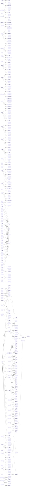

# 泊头鸭梨知识图谱 V1

虚线为待验证假设；流程边不表示因果。

```mermaid
flowchart LR
  n0["泊头鸭梨"]
  n1["泊头市"]
  n2["梨"]
  n3["盐碱地梨园选址"]
  n4["土层深厚"]
  n5["建园"]
  n6["土壤 pH 7.1～8.5"]
  n7["土壤含盐量 0.1%～0.3%"]
  n8["砂壤至中壤质潮土"]
  n9["盐碱地土壤工程改良"]
  n10["灌排设施配套"]
  n11["灌水洗盐"]
  n12["排水排盐"]
  n13["盐碱地土壤生物改良"]
  n14["微生物肥料"]
  n15["增施有机肥"]
  n16["秸秆还田"]
  n17["种植绿肥"]
  n18["种植耐盐植物"]
  n19["盐碱地土壤化学改良"]
  n20["使用土壤改良剂调节酸碱性"]
  n21["盐碱地梨苗选择"]
  n22["当地传统品种或审定耐盐优良品种"]
  n23["杜梨砧木"]
  n24["符合引用标准的二级以上苗木"]
  n25["盐碱地梨定植"]
  n26["优先春栽"]
  n27["定植"]
  n28["南北行向"]
  n29["栽植沟宽深各 80 cm"]
  n30["表土与心土分放"]
  n31["沟底秸秆层约 20 cm"]
  n32["腐熟农家肥与表土混合"]
  n33["回填后灌水沉实"]
  n34["栽植穴直径及深度各 40 cm"]
  n35["定干高度 60～80 cm"]
  n36["栽后浇水覆膜"]
  n37["盐碱地梨园地表管理"]
  n38["结合施基肥深翻"]
  n39["田间管理"]
  n40["耐盐绿肥或自然生草"]
  n41["刈割后留茬 10～15 cm"]
  n42["秸秆覆盖或黑色园艺地布"]
  n43["盐碱地梨施肥"]
  n44["有机肥与配方肥结合"]
  n45["秋施基肥"]
  n46["环状沟或条状沟或放射沟施肥"]
  n47["花前追肥"]
  n48["膨大期追肥"]
  n49["盐碱地梨水分管理"]
  n50["依据土壤墒情灌水"]
  n51["萌芽前灌水"]
  n52["落花后灌水"]
  n53["果实膨大期灌水"]
  n54["封冻前灌水"]
  n55["滴灌或渗灌"]
  n56["大雨后及时排水"]
  n57["梨园生产档案"]
  n58["记录环境条件"]
  n59["记录生产技术"]
  n60["记录肥水管理"]
  n61["记录病虫害发生"]
  n62["记录病虫害防治"]
  n63["记录采收"]
  n64["专人管理档案"]
  n65["梨园产地选择"]
  n66["日照时数 1600～1700 h"]
  n67["土壤有机质大于 1%"]
  n68["砂质壤土"]
  n69["坡度小于 15°"]
  n70["梨园品种和砧木选择"]
  n71["按当地气候和土壤选品种"]
  n72["河北中南部适用杜梨砧木"]
  n73["河北东部和北部适用山梨砧木"]
  n74["梨园栽植配置"]
  n75["稀植株行距 3～4 m × 4～5 m"]
  n76["密植株行距 2～3 m × 3～4 m"]
  n77["每园配置 2～4 个品种"]
  n78["经济价值相当品种可等行配置"]
  n79["主栽与授粉树比例 4∶1～8∶1"]
  n80["梨树整形修剪"]
  n81["稀植可用疏散分层形"]
  n82["稀植可用单层一心形"]
  n83["密植可用细长纺锤形"]
  n84["幼树冬剪重在树形"]
  n85["初果树培养骨架"]
  n86["盛果树调节光照和树势"]
  n87["夏剪去竞争枝"]
  n88["夏剪抹芽"]
  n89["夏剪去直立旺梢"]
  n90["梨园土壤管理"]
  n91["秋季施基肥时隔行深翻"]
  n92["深翻沟宽 50～60 cm"]
  n93["深翻沟深 40～60 cm"]
  n94["结合深翻施有机肥"]
  n95["生草可用三叶草"]
  n96["生草可用黑麦草"]
  n97["生草可用二月兰"]
  n98["翻压或刈割覆盖"]
  n99["梨园肥水管理"]
  n100["按土壤肥力配施氮磷钾"]
  n101["结果树秋施商品有机肥"]
  n102["萌芽期追肥"]
  n103["花芽分化期追肥"]
  n104["果实膨大期追肥"]
  n105["根区交替灌溉或沟灌"]
  n106["梨花果管理"]
  n107["人工辅助授粉或放蜂"]
  n108["花果管理"]
  n109["疏花在花序分离至开花期"]
  n110["每花序保留基部 2～4 朵花"]
  n111["落花后 10～20 d 疏果"]
  n112["留果间距 20～30 cm"]
  n113["落花后 20 d 开始套袋"]
  n114["选用韧性强透气的专用纸袋"]
  n115["梨采收决策"]
  n116["结合品种成熟特性"]
  n117["采收期"]
  n118["果实成熟度"]
  n119["结合果实用途"]
  n120["避开雨天"]
  n121["避开露水未干时段"]
  n122["选择晴天凉爽时段"]
  n123["梨人工采收"]
  n124["由外向内采"]
  n125["由上向下采"]
  n126["轻拿轻放"]
  n127["避免牵拉果梗"]
  n128["牵拉果梗"]
  n129["果实内部损伤"]
  n130["梗基腐烂风险"]
  n131["储藏期"]
  n132["梨出库运输"]
  n133["出库回温"]
  n134["运输期"]
  n135["果面与环境温差小于 10 ℃"]
  n136["避免机械损伤"]
  n137["长途运输温度 2～5 ℃"]
  n138["长途运输相对湿度不低于 85%"]
  n139["梨包装"]
  n140["容器结实"]
  n141["包装期"]
  n142["容器无异味"]
  n143["容器内壁光滑"]
  n144["箱内加垫"]
  n145["单果包装纸"]
  n146["网套保护"]
  n147["高二氧化碳透过率保鲜袋或打孔微孔袋"]
  n148["黄冠贮藏"]
  n149["10～15 ℃逐渐降至 0 ℃"]
  n150["黄冠"]
  n151["相对湿度 90%～95%"]
  n152["鸭梨贮藏"]
  n153["10～12 ℃逐渐降至 0 ℃"]
  n154["鸭梨"]
  n155["雪花贮藏"]
  n156["0 ℃"]
  n157["雪花"]
  n158["红香酥贮藏"]
  n159["0～1 ℃"]
  n160["红香酥"]
  n161["京白贮藏"]
  n162["−1～0 ℃"]
  n163["京白"]
  n164["玉露香贮藏"]
  n165["玉露香"]
  n166["雪青贮藏"]
  n167["雪青"]
  n168["南果贮藏"]
  n169["南果"]
  n170["苹果梨贮藏"]
  n171["苹果梨"]
  n172["黄金贮藏"]
  n173["黄金"]
  n174["丰水贮藏"]
  n175["丰水"]
  n176["新高贮藏"]
  n177["新高"]
  n178["蜜梨贮藏"]
  n179["蜜梨"]
  n180["砀山酥梨贮藏"]
  n181["砀山酥梨"]
  n182["巴梨贮藏"]
  n183["巴梨"]
  n184["早酥贮藏"]
  n185["0～2 ℃"]
  n186["早酥"]
  n187["香水梨贮藏"]
  n188["香水梨"]
  n189["花盖梨贮藏"]
  n190["花盖梨"]
  n191["库尔勒香梨贮藏"]
  n192["库尔勒香梨"]
  n193["梨缓慢回温"]
  n194["出库前缓慢升温"]
  n195["出库期"]
  n196["果心与外界温差小于 10 ℃"]
  n197["梨长途运输"]
  n198["温度 2～5 ℃"]
  n199["相对湿度不低于 85%"]
  n200["梨货架场所管理"]
  n201["清洁与消毒"]
  n202["货架期"]
  n203["梨低温货架"]
  n204["温度 0～5 ℃"]
  n205["相对湿度 85%～95%"]
  n206["低温货架时间少于 30 d"]
  n207["梨常温货架"]
  n208["常温货架时间少于 10 d"]
  n209["青绿霉病"]
  n210["褐腐病"]
  n211["轮纹病"]
  n212["冷害"]
  n213["二氧化碳伤害"]
  n214["剔除病虫果"]
  n215["采后腐烂风险"]
  n216["分选期"]
  n217["剔除机械损伤果"]
  n218["减少采收搬运损伤"]
  n219["贮藏场所消毒"]
  n220["机械损伤"]
  n221["过低贮藏温度"]
  n222["过高二氧化碳浓度"]
  n223["果心褐变"]
  n224["果肉褐变"]
  n225["梨采收成熟度判断"]
  n226["果实硬度"]
  n227["结合生长天数"]
  n228["可溶性固形物含量"]
  n229["梨分级"]
  n230["果形"]
  n231["果实色泽"]
  n232["单果质量"]
  n233["果径"]
  n234["果面缺陷"]
  n235["鸭梨入库降温"]
  n236["无需单独预冷"]
  n237["按规程在库内梯度降温"]
  n238["乙烯积累"]
  n239["果实衰老"]
  n240["通风换气"]
  n241["梨黑星病"]
  n242["果面橄榄黑色绒状病斑"]
  n243["叶片皱缩扭曲"]
  n244["早期侵染后果实畸形"]
  n245["晚期针尖状黑斑"]
  n246["梨木虱（Cacopsylla pyricola）"]
  n247["蜜露污染"]
  n248["煤污覆盖"]
  n249["果皮锈斑"]
  n250["叶片黄化"]
  n251["落叶"]
  n252["梨锈螨"]
  n253["组织铜色化"]
  n254["萼端锈斑"]
  n255["梗端锈斑"]
  n256["梨叶瘿螨"]
  n257["芽干枯"]
  n258["叶片水疱状瘿斑"]
  n259["椭圆形果面锈斑"]
  n260["果实畸形"]
  n261["梨圆蚧"]
  n262["红紫色环斑"]
  n263["果面凹凸"]
  n264["枝条枯死"]
  n265["梨园蚜虫"]
  n266["叶片卷曲"]
  n267["新梢生长受抑"]
  n268["果面煤污"]
  n269["梨园粉蚧"]
  n270["萼端受害"]
  n271["果面锈斑"]
  n272["梨园蓟马"]
  n273["果面痂斑"]
  n274["结网叶螨"]
  n275["叶片发黑"]
  n276["果实生长受抑"]
  n277["梨衰退病"]
  n278["新梢生长不良"]
  n279["枝梢枯死"]
  n280["叶片提前变红"]
  n281["叶缘上卷"]
  n282["叶片变小"]
  n283["果实变小"]
  n284["提前落叶"]
  n285["梨细菌性花枯病"]
  n286["花芽干枯"]
  n287["果面黑色凹斑"]
  n288["叶片黑色斑点"]
  n289["梨火疫病"]
  n290["新梢弯曲呈牧羊杖状"]
  n291["花器萎蔫发黑"]
  n292["琥珀色菌脓"]
  n293["苹果蠹蛾"]
  n294["果面浅蛀孔"]
  n295["直达种子腔的蛀道"]
  n296["虫粪堵塞蛀孔"]
  n297["苹果全爪螨"]
  n298["叶片失绿斑驳"]
  n299["叶片铜色化"]
  n300["高温下叶片褐化干枯"]
  n301["斜带卷叶蛾"]
  n302["幼果深凹陷"]
  n303["果面浅表蛀道"]
  n304["西部槭树蝽"]
  n305["果面暗色凹点"]
  n306["果皮下硬质髓状区域"]
  n307["梨园螽斯"]
  n308["叶片取食损伤"]
  n309["近采收期果实咬伤"]
  n310["蜜环菌根颈腐烂病"]
  n311["树势衰退"]
  n312["皮下乳白色菌丝层"]
  n313["黑色根状菌索"]
  n314["持续湿润"]
  n315["梨黑星病初侵染"]
  n316["梨黑星病二次传播"]
  n317["Venturia pirina"]
  n318["采收果实抽样"]
  n319["检查蛀孔"]
  n320["检查煤污"]
  n321["检查果锈"]
  n322["检查黑星病斑"]
  n323["记录采收受害情况"]
  n324["采后梨园调查"]
  n325["检查树上残留果"]
  n326["采后田间管理"]
  n327["抽取顶梢检查"]
  n328["记录黑星病斑"]
  n329["记录捕食螨"]
  n330["记录木虱卵和若虫"]
  n331["花期害虫抽样"]
  n332["抽取树顶和视线高度花序"]
  n333["开花期"]
  n334["检查木虱卵和若虫"]
  n335["检查螨类"]
  n336["检查毛虫"]
  n337["检查蓟马"]
  n338["果实发育期抽样"]
  n339["定期抽查叶片和果实"]
  n340["果实膨大期"]
  n341["检查果面蛀孔"]
  n342["检查萼端和梗端锈斑"]
  n343["记录虫害观察结果"]
  n344["休眠期抽样"]
  n345["振落法调查木虱"]
  n346["休眠期"]
  n347["检查芽鳞和短果枝"]
  n348["检查枝梢蚧虫"]
  n349["检查黑星病枝梢斑"]
  n350["检查树皮下粉蚧"]
  n351["采前晚期黑星病感染"]
  n352["储藏中显现黑星病斑"]
  n353["LAC基因表达变化"]
  n354["黑星病初侵染预防"]
  n355["温湿条件监测"]
  n356["高成熟度鸭梨快速降温试验"]
  n357["果心褐变指数较低"]
  n358["乙烯释放较低"]
  n359["呼吸强度较低"]
  n360["果实硬度保持较好"]
  n361["鸭梨果心褐变进程"]
  n362["心室开始褐变"]
  n363["褐变向果肉扩展"]
  n364["中期采收鸭梨缓冷试验"]
  n0 -->|LOCATED_IN| n1
  n3 -->|REQUIRES| n4
  n3 -->|REQUIRES| n6
  n3 -->|REQUIRES| n7
  n3 -->|REQUIRES| n8
  n9 -->|REQUIRES| n10
  n9 -->|REQUIRES| n11
  n9 -->|REQUIRES| n12
  n13 -->|REQUIRES| n14
  n13 -->|REQUIRES| n15
  n13 -->|REQUIRES| n16
  n13 -->|REQUIRES| n17
  n13 -->|REQUIRES| n18
  n19 -->|REQUIRES| n20
  n21 -->|REQUIRES| n22
  n21 -->|REQUIRES| n23
  n21 -->|REQUIRES| n24
  n25 -->|REQUIRES| n26
  n25 -->|REQUIRES| n28
  n25 -->|REQUIRES| n29
  n25 -->|REQUIRES| n30
  n25 -->|REQUIRES| n31
  n25 -->|REQUIRES| n32
  n25 -->|REQUIRES| n33
  n25 -->|REQUIRES| n34
  n25 -->|REQUIRES| n35
  n25 -->|REQUIRES| n36
  n37 -->|REQUIRES| n38
  n37 -->|REQUIRES| n40
  n37 -->|REQUIRES| n41
  n37 -->|REQUIRES| n42
  n43 -->|REQUIRES| n44
  n43 -->|REQUIRES| n45
  n43 -->|REQUIRES| n46
  n43 -->|REQUIRES| n47
  n43 -->|REQUIRES| n48
  n49 -->|REQUIRES| n50
  n49 -->|REQUIRES| n51
  n49 -->|REQUIRES| n52
  n49 -->|REQUIRES| n53
  n49 -->|REQUIRES| n54
  n49 -->|REQUIRES| n55
  n49 -->|REQUIRES| n56
  n57 -->|REQUIRES| n58
  n57 -->|REQUIRES| n59
  n57 -->|REQUIRES| n60
  n57 -->|REQUIRES| n61
  n57 -->|REQUIRES| n62
  n57 -->|REQUIRES| n63
  n57 -->|REQUIRES| n64
  n65 -->|REQUIRES| n66
  n65 -->|REQUIRES| n67
  n65 -->|REQUIRES| n68
  n65 -->|REQUIRES| n69
  n70 -->|REQUIRES| n71
  n70 -->|REQUIRES| n72
  n70 -->|REQUIRES| n73
  n74 -->|REQUIRES| n75
  n74 -->|REQUIRES| n76
  n74 -->|REQUIRES| n77
  n74 -->|REQUIRES| n78
  n74 -->|REQUIRES| n79
  n80 -->|REQUIRES| n81
  n80 -->|REQUIRES| n82
  n80 -->|REQUIRES| n83
  n80 -->|REQUIRES| n84
  n80 -->|REQUIRES| n85
  n80 -->|REQUIRES| n86
  n80 -->|REQUIRES| n87
  n80 -->|REQUIRES| n88
  n80 -->|REQUIRES| n89
  n90 -->|REQUIRES| n91
  n90 -->|REQUIRES| n92
  n90 -->|REQUIRES| n93
  n90 -->|REQUIRES| n94
  n90 -->|REQUIRES| n95
  n90 -->|REQUIRES| n96
  n90 -->|REQUIRES| n97
  n90 -->|REQUIRES| n98
  n99 -->|REQUIRES| n100
  n99 -->|REQUIRES| n101
  n99 -->|REQUIRES| n102
  n99 -->|REQUIRES| n103
  n99 -->|REQUIRES| n104
  n99 -->|REQUIRES| n105
  n106 -->|REQUIRES| n107
  n106 -->|REQUIRES| n109
  n106 -->|REQUIRES| n110
  n106 -->|REQUIRES| n111
  n106 -->|REQUIRES| n112
  n106 -->|REQUIRES| n113
  n106 -->|REQUIRES| n114
  n115 -->|REQUIRES| n116
  n115 -->|REQUIRES| n118
  n115 -->|REQUIRES| n119
  n115 -->|REQUIRES| n120
  n115 -->|REQUIRES| n121
  n115 -->|REQUIRES| n122
  n123 -->|REQUIRES| n124
  n123 -->|REQUIRES| n125
  n123 -->|REQUIRES| n126
  n123 -->|REQUIRES| n127
  n128 -->|INCREASES_RISK| n129
  n128 -->|INCREASES_RISK| n130
  n132 -->|REQUIRES| n133
  n132 -->|REQUIRES| n135
  n132 -->|REQUIRES| n136
  n132 -->|REQUIRES| n137
  n132 -->|REQUIRES| n138
  n139 -->|REQUIRES| n140
  n139 -->|REQUIRES| n142
  n139 -->|REQUIRES| n143
  n139 -->|REQUIRES| n144
  n139 -->|REQUIRES| n145
  n139 -->|REQUIRES| n146
  n139 -->|REQUIRES| n147
  n148 -->|REQUIRES| n149
  n148 -->|REQUIRES| n151
  n152 -->|REQUIRES| n153
  n152 -->|REQUIRES| n151
  n155 -->|REQUIRES| n156
  n155 -->|REQUIRES| n151
  n158 -->|REQUIRES| n159
  n158 -->|REQUIRES| n151
  n161 -->|REQUIRES| n162
  n161 -->|REQUIRES| n151
  n164 -->|REQUIRES| n162
  n164 -->|REQUIRES| n151
  n166 -->|REQUIRES| n153
  n166 -->|REQUIRES| n151
  n168 -->|REQUIRES| n156
  n168 -->|REQUIRES| n151
  n170 -->|REQUIRES| n162
  n170 -->|REQUIRES| n151
  n172 -->|REQUIRES| n159
  n172 -->|REQUIRES| n151
  n174 -->|REQUIRES| n159
  n174 -->|REQUIRES| n151
  n176 -->|REQUIRES| n159
  n176 -->|REQUIRES| n151
  n178 -->|REQUIRES| n156
  n178 -->|REQUIRES| n151
  n180 -->|REQUIRES| n162
  n180 -->|REQUIRES| n151
  n182 -->|REQUIRES| n156
  n182 -->|REQUIRES| n151
  n184 -->|REQUIRES| n185
  n184 -->|REQUIRES| n151
  n187 -->|REQUIRES| n156
  n187 -->|REQUIRES| n151
  n189 -->|REQUIRES| n162
  n189 -->|REQUIRES| n151
  n191 -->|REQUIRES| n162
  n191 -->|REQUIRES| n151
  n193 -->|REQUIRES| n194
  n193 -->|REQUIRES| n196
  n197 -->|REQUIRES| n198
  n197 -->|REQUIRES| n199
  n200 -->|REQUIRES| n201
  n203 -->|REQUIRES| n204
  n203 -->|REQUIRES| n205
  n203 -->|REQUIRES| n206
  n207 -->|REQUIRES| n208
  n2 -->|HAS_DISEASE| n209
  n2 -->|HAS_DISEASE| n210
  n2 -->|HAS_DISEASE| n211
  n2 -->|HAS_DISORDER| n212
  n2 -->|HAS_DISORDER| n213
  n214 -->|INTERVENTION_FOR| n215
  n217 -->|INTERVENTION_FOR| n215
  n218 -->|INTERVENTION_FOR| n215
  n219 -->|INTERVENTION_FOR| n215
  n220 -->|INCREASES_RISK| n215
  n221 -->|INCREASES_RISK| n212
  n222 -->|INCREASES_RISK| n213
  n212 -->|HAS_SYMPTOM| n223
  n212 -->|HAS_SYMPTOM| n224
  n213 -->|HAS_SYMPTOM| n223
  n213 -->|HAS_SYMPTOM| n224
  n225 -->|REQUIRES| n226
  n225 -->|REQUIRES| n227
  n225 -->|REQUIRES| n228
  n229 -->|REQUIRES| n230
  n229 -->|REQUIRES| n231
  n229 -->|REQUIRES| n232
  n229 -->|REQUIRES| n233
  n229 -->|REQUIRES| n234
  n235 -->|REQUIRES| n236
  n235 -->|REQUIRES| n237
  n238 -->|PROMOTES| n239
  n240 -->|INTERVENTION_FOR| n238
  n241 -->|HAS_SYMPTOM| n242
  n241 -->|HAS_SYMPTOM| n243
  n241 -->|HAS_SYMPTOM| n244
  n241 -->|HAS_SYMPTOM| n245
  n2 -->|HAS_DISEASE| n241
  n246 -->|HAS_SYMPTOM| n247
  n246 -->|HAS_SYMPTOM| n248
  n246 -->|HAS_SYMPTOM| n249
  n246 -->|HAS_SYMPTOM| n250
  n246 -->|HAS_SYMPTOM| n251
  n2 -->|HAS_PEST| n246
  n252 -->|HAS_SYMPTOM| n253
  n252 -->|HAS_SYMPTOM| n254
  n252 -->|HAS_SYMPTOM| n255
  n2 -->|HAS_PEST| n252
  n256 -->|HAS_SYMPTOM| n257
  n256 -->|HAS_SYMPTOM| n258
  n256 -->|HAS_SYMPTOM| n259
  n256 -->|HAS_SYMPTOM| n260
  n2 -->|HAS_PEST| n256
  n261 -->|HAS_SYMPTOM| n262
  n261 -->|HAS_SYMPTOM| n263
  n261 -->|HAS_SYMPTOM| n260
  n261 -->|HAS_SYMPTOM| n264
  n2 -->|HAS_PEST| n261
  n265 -->|HAS_SYMPTOM| n266
  n265 -->|HAS_SYMPTOM| n267
  n265 -->|HAS_SYMPTOM| n247
  n265 -->|HAS_SYMPTOM| n268
  n2 -->|HAS_PEST| n265
  n269 -->|HAS_SYMPTOM| n270
  n269 -->|HAS_SYMPTOM| n247
  n269 -->|HAS_SYMPTOM| n271
  n269 -->|HAS_SYMPTOM| n268
  n2 -->|HAS_PEST| n269
  n272 -->|HAS_SYMPTOM| n271
  n272 -->|HAS_SYMPTOM| n273
  n272 -->|HAS_SYMPTOM| n260
  n2 -->|HAS_PEST| n272
  n274 -->|HAS_SYMPTOM| n275
  n274 -->|HAS_SYMPTOM| n251
  n274 -->|HAS_SYMPTOM| n276
  n2 -->|HAS_PEST| n274
  n277 -->|HAS_SYMPTOM| n278
  n277 -->|HAS_SYMPTOM| n279
  n277 -->|HAS_SYMPTOM| n280
  n277 -->|HAS_SYMPTOM| n281
  n277 -->|HAS_SYMPTOM| n282
  n277 -->|HAS_SYMPTOM| n283
  n277 -->|HAS_SYMPTOM| n284
  n2 -->|HAS_DISEASE| n277
  n285 -->|HAS_SYMPTOM| n286
  n285 -->|HAS_SYMPTOM| n287
  n285 -->|HAS_SYMPTOM| n288
  n2 -->|HAS_DISEASE| n285
  n289 -->|HAS_SYMPTOM| n290
  n289 -->|HAS_SYMPTOM| n291
  n289 -->|HAS_SYMPTOM| n292
  n2 -->|HAS_DISEASE| n289
  n293 -->|HAS_SYMPTOM| n294
  n293 -->|HAS_SYMPTOM| n295
  n293 -->|HAS_SYMPTOM| n296
  n2 -->|HAS_PEST| n293
  n297 -->|HAS_SYMPTOM| n298
  n297 -->|HAS_SYMPTOM| n299
  n297 -->|HAS_SYMPTOM| n300
  n2 -->|HAS_PEST| n297
  n301 -->|HAS_SYMPTOM| n302
  n301 -->|HAS_SYMPTOM| n303
  n2 -->|HAS_PEST| n301
  n304 -->|HAS_SYMPTOM| n305
  n304 -->|HAS_SYMPTOM| n306
  n2 -->|HAS_PEST| n304
  n307 -->|HAS_SYMPTOM| n308
  n307 -->|HAS_SYMPTOM| n309
  n2 -->|HAS_PEST| n307
  n310 -->|HAS_SYMPTOM| n311
  n310 -->|HAS_SYMPTOM| n312
  n310 -->|HAS_SYMPTOM| n313
  n2 -->|HAS_DISEASE| n310
  n314 -->|PROMOTES| n315
  n315 -->|PROMOTES| n316
  n241 -->|HAS_PATHOGEN| n317
  n318 -->|REQUIRES| n319
  n318 -->|REQUIRES| n320
  n318 -->|REQUIRES| n321
  n318 -->|REQUIRES| n322
  n318 -->|REQUIRES| n323
  n324 -->|REQUIRES| n325
  n324 -->|REQUIRES| n327
  n324 -->|REQUIRES| n328
  n324 -->|REQUIRES| n329
  n324 -->|REQUIRES| n330
  n331 -->|REQUIRES| n332
  n331 -->|REQUIRES| n334
  n331 -->|REQUIRES| n335
  n331 -->|REQUIRES| n336
  n331 -->|REQUIRES| n337
  n338 -->|REQUIRES| n339
  n338 -->|REQUIRES| n341
  n338 -->|REQUIRES| n342
  n338 -->|REQUIRES| n343
  n344 -->|REQUIRES| n345
  n344 -->|REQUIRES| n347
  n344 -->|REQUIRES| n348
  n344 -->|REQUIRES| n349
  n344 -->|REQUIRES| n350
  n351 -->|ASSOCIATED_WITH| n352
  n353 -->|ASSOCIATED_WITH| n223
  n241 -->|HAS_PROCESS| n315
  n241 -->|HAS_PROCESS| n316
  n241 -->|CONTROLLED_BY| n354
  n354 -->|INTERVENTION_FOR| n315
  n241 -->|RECOMMENDS| n355
  n241 -->|HAS_PROCESS| n351
  n106 -->|OCCURS_AT_STAGE| n333
  n356 -->|ASSOCIATED_WITH| n357
  n356 -->|ASSOCIATED_WITH| n358
  n356 -->|ASSOCIATED_WITH| n359
  n356 -->|ASSOCIATED_WITH| n360
  n361 -->|HAS_SYMPTOM| n362
  n361 -->|HAS_SYMPTOM| n363
  n364 -->|ASSOCIATED_WITH| n357
  n364 -->|ASSOCIATED_WITH| n360
```
