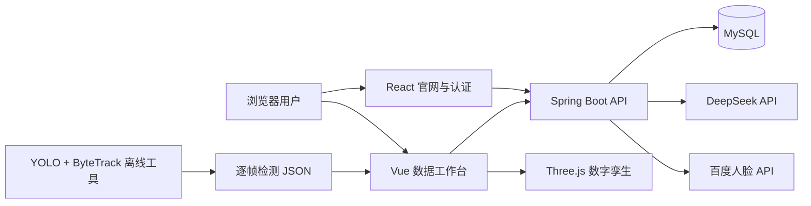
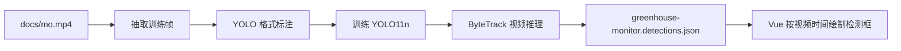
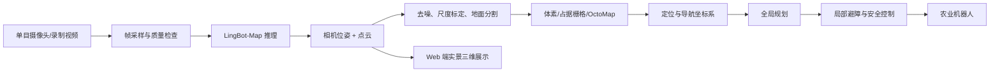
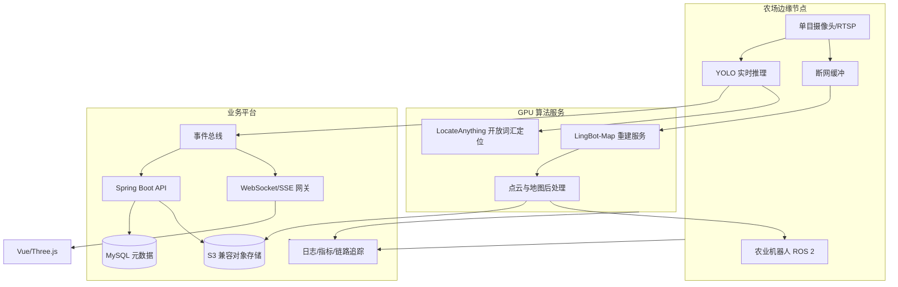
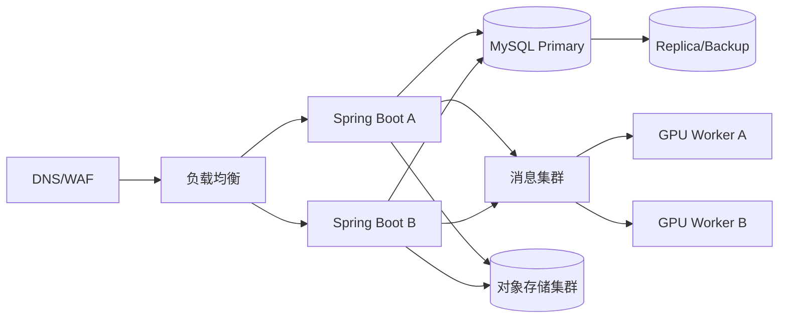

# 田言耕智智慧农业平台技术说明手册

> 文档版本：1.0  
> 编制日期：2026-08-05  
> 适用项目：田言耕智（ty）  
> 读者：开发、测试、部署、运维、算法与机器人集成人员

## 1. 文档目的与边界

本文说明项目的系统架构、源码组织、部署配置、数据模型、接口、测试方法，以及视觉识别和温室实景建图的演进方案。

文中能力分为两类：

- **当前已实现**：仓库中已有代码、资源或接口，可按本文步骤运行和验证。
- **规划接入**：LingBot-Map、机器人导航、NVIDIA LocateAnything 等后续方案。它们尚不能被描述为当前生产能力。

用户操作请配合阅读[《用户使用手册》](./用户使用手册.md)。

## 2. 系统概览

田言耕智是一个包含官网、身份认证、农场数字孪生、温室内部可视化、设备控制、灌溉管理、告警管理和 AI 问农的全栈系统。



### 2.1 技术栈

| 层次 | 技术 | 主要用途 |
|---|---|---|
| 官网 | React 18、Vite | 产品介绍、联系、注册和登录 |
| 数据平台 | Vue 3、TypeScript、Vite | 农场工作台与温室内部页面 |
| 3D | Three.js 0.152.x | 农场及温室数字孪生场景 |
| 后端 | Java 17、Spring Boot 4.1 | REST API、业务逻辑与安全控制 |
| 数据库 | MySQL 8.x、Spring Data JPA | 用户、设备、环境、告警和状态持久化 |
| 鉴权 | JWT、Spring Security | 无状态身份认证和接口保护 |
| AI 问农 | DeepSeek 兼容 API | 农业问答和上下文响应 |
| 人脸能力 | 百度智能云人脸 API | 人脸注册、检索和登录 |
| 监控识别 | Ultralytics YOLO、ByteTrack | 离线视频检测、跨帧目标 ID |

## 3. 当前能力清单

### 3.1 已实现

- 官网、产品、解决方案、数字孪生、关于和联系页面；
- 邮箱密码注册与登录；
- 注册后可选人脸绑定、摄像头刷脸登录、人脸解绑；
- JWT 会话及当前用户查询；
- 农场总览、环境数据、设备状态、灌溉、告警；
- 鸟瞰、3D 和第一人称农场场景；
- 设备、灌溉和告警的交互式控制；
- AI 问农和用户助手状态保存；
- 大棚详情入口及双击 3D 大棚进入；
- 六座大棚的差异化作物、模型、设备和区域信息；
- 温室内部数字孪生与实景视频切换；
- YOLO + ByteTrack 离线监控检测结果叠加。

### 3.2 规划中

- LingBot-Map 单目视频/图片流三维重建；
- 重建结果向机器人占据地图和导航坐标系转换；
- 在线相机流、边缘推理服务和实时检测消息通道；
- NVIDIA LocateAnything 开放词汇定位；
- 多租户、生产级对象存储、可观测性和高可用部署。

## 4. 源码与构建产物

```text
ty/
├── landing/                         React 官网源码
├── frontend/                        Vue 数据平台源码
├── src/main/java/com/example/ty/    Spring Boot 后端
│   ├── auth/                        认证、人脸和 JWT
│   ├── dashboard/                   农场与温室业务
│   └── assistant/                   AI 问农及状态
├── src/main/resources/
│   ├── application.yaml             服务配置
│   └── static/                      已构建的前端资源
│       └── platform/                Vue 平台构建产物
├── src/test/                         后端测试
├── tools/yolo/                       YOLO 数据、训练和导出工具
├── docs/                             图片、视频和项目文档
├── pom.xml                           Maven 配置
├── start.sh                          启动辅助脚本
└── setup-mysql.sh                    MySQL 初始化辅助脚本
```

注意：`landing/` 和 `frontend/` 是源代码；`src/main/resources/static/` 是构建产物。修改源代码后必须重新构建，不能只编辑构建后的压缩文件。

## 5. 环境准备

### 5.1 最低软件要求

- JDK 17；
- MySQL 8.x；
- Node.js 18 或更高版本及 npm；
- Git；
- 支持 WebGL 的现代浏览器。

运行 YOLO 工具时还需要 Python 3、虚拟环境和对应的 PyTorch/Ultralytics 依赖。使用 CUDA 时，应先确认 NVIDIA 驱动和 `nvidia-smi` 正常。

### 5.2 数据库

默认配置连接：

```text
jdbc:mysql://localhost:3306/tianyan
用户名：root
密码：Root_123456
```

推荐通过环境变量覆盖默认值：

```bash
export DB_URL='jdbc:mysql://127.0.0.1:3306/tianyan?useUnicode=true&characterEncoding=utf8&serverTimezone=Asia/Shanghai'
export DB_USERNAME='tianyan_app'
export DB_PASSWORD='请使用独立强密码'
```

可执行项目脚本初始化数据库：

```bash
./setup-mysql.sh
```

生产环境应为应用建立最小权限数据库账号，不应继续使用 `root`。

### 5.3 后端环境变量

| 变量 | 必需性 | 说明 |
|---|---|---|
| `SERVER_PORT` | 可选 | 默认 8081 |
| `DB_URL` | 建议显式设置 | JDBC 地址 |
| `DB_USERNAME` | 建议显式设置 | 数据库用户 |
| `DB_PASSWORD` | 建议显式设置 | 数据库密码 |
| `JWT_SECRET` | 生产必需 | JWT 签名密钥，至少 32 字节随机值 |
| `BAIDU_FACE_AK` | 使用人脸时必需 | 百度人脸 Access Key |
| `BAIDU_FACE_SK` | 使用人脸时必需 | 百度人脸 Secret Key |
| `DEEPSEEK_API_KEY` | 使用 AI 时必需 | 模型 API 密钥 |
| `DEEPSEEK_BASE_URL` | 可选 | DeepSeek 兼容接口地址 |
| `DEEPSEEK_MODEL` | 可选 | 模型名称 |

不要把真实密钥写入 Git。开发环境可使用 IDE 环境变量或未跟踪的本地启动配置；生产环境使用 Secret 管理服务。

## 6. 构建与启动

### 6.1 构建官网

```bash
cd landing
npm install
npm run build
```

构建输出应进入 Spring Boot 静态资源目录。完成后返回仓库根目录。

### 6.2 构建 Vue 数据平台

```bash
cd frontend
npm install
npm run build
```

输出目标为 `src/main/resources/static/platform/`。文件名带内容哈希，重新构建后旧文件名变化是正常现象。

### 6.3 测试和启动后端

```bash
./mvnw test
./mvnw spring-boot:run
```

浏览器访问：

```text
http://localhost:8081/
```

也可以使用项目的组合启动脚本：

```bash
./start.sh
```

### 6.4 推荐构建顺序

1. 检查 MySQL 是否运行；
2. 配置数据库、JWT、百度人脸和 DeepSeek 环境变量；
3. 构建 React 官网；
4. 构建 Vue 数据平台；
5. 执行 Maven 测试；
6. 启动 Spring Boot；
7. 完成注册、登录、工作台、温室和 API 冒烟测试。

## 7. 前端路由与页面协作

### 7.1 官网路由

官网使用 HashRouter，主要地址为：

| 地址 | 页面 |
|---|---|
| `/#/` | 官网首页 |
| `/#/product` | 产品 |
| `/#/solutions` | 解决方案 |
| `/#/digital-twin` | 数字孪生介绍 |
| `/#/about` | 关于 |
| `/#/contact` | 联系我们 |
| `/#/sign-in` | 登录 |
| `/#/sign-up` | 注册 |

### 7.2 数据平台路由

| 地址 | 页面 |
|---|---|
| `/platform/workspaces/farm-01` | 农场数据工作台 |
| `/platform/assistant` | AI 问农 |
| `/platform/workspaces/:id/greenhouses/:greenhouseId` | 温室内部 |
| `/platform/digital-twin` | 数字孪生入口 |

Spring Boot 必须对 Vue 历史路由执行前端回退，否则直接刷新深层 URL 会出现 404。

### 7.3 状态流

1. 官网登录接口返回 JWT 和用户信息；
2. 浏览器保存会话；
3. Vue 平台请求时附加 `Authorization: Bearer <token>`；
4. Spring Security 验证 JWT 后把用户身份放入安全上下文；
5. Dashboard 和 Assistant 服务根据身份及 `farmId` 返回数据；
6. Three.js 只负责可视化，不应成为业务数据的唯一来源。

### 7.4 当前界面实现基线

以下截图来自当前仓库对应版本，用于开发联调、视觉回归和验收。后续修改布局时，应确保路由、核心入口和数据关系保持一致。


> **图 7-1　React 官网基线。** 官网负责产品信息和身份入口，不承载登录后的农场业务状态。


> **图 7-2　Vue 航拍工作台基线。** 空间对象、右侧上下文抽屉和底部业务 Dock 共享工作区状态；选中对象后，地图高亮与详情数据必须指向相同业务 ID。


> **图 7-3　AI 自定义工作台基线。** 告警、灌溉、大棚和指标组件读取统一 Dashboard 数据；用户布局与助手状态通过当前账号隔离保存。

## 8. 后端模块

### 8.1 认证模块

认证模块负责用户注册、密码哈希、登录、JWT 签发和当前用户查询。密码必须只存储哈希，API 响应不得返回密码字段。


> **图 8-1　认证页面基线。** 密码登录和刷脸登录共用页面容器但使用独立提交链路；注册入口必须始终可见，刷脸模式不得出现本地图片上传控件。

人脸流程：浏览器摄像头采集图像 → 后端校验 → 百度人脸组注册或检索 → 绑定或签发登录令牌。当前产品已禁止从本地上传图片进行刷脸登录，目的是降低照片替代真人采集的风险。但这不等同于完整活体检测；生产环境仍应增加动作活体、静默活体、重放防护、限流和审计。

### 8.2 Dashboard 模块

该模块聚合农场资产、环境指标、设备、灌溉单元和告警，并生成差异化温室详情。写操作由服务层校验实体是否属于请求中的农场，避免跨农场修改。

### 8.3 Assistant 模块

AI 问农接收历史消息与可选场景上下文，调用兼容的模型接口并返回文本。用户助手状态单独持久化，用于保留界面配置或会话相关状态。


> **图 8-2　智能问农基线。** 对话列表、输入区、快捷问题和应用 Dock 属于用户状态；模型回答来自后端接口，前端不得用静态成功内容掩盖上游调用失败。

生产环境需要：输入长度限制、超时、重试上限、敏感信息过滤、提示注入防护、调用审计和费用告警。

## 9. REST API

除注册和登录类接口外，业务接口默认要求 JWT。

### 9.1 注册

```http
POST /api/auth/register
Content-Type: application/json

{
  "name": "演示用户",
  "email": "user@example.com",
  "password": "StrongPassword_2026!"
}
```

成功响应包含 `token` 和 `user`。邮箱重复、参数不合法或密码不满足约束时应返回 4xx。

### 9.2 密码登录

```http
POST /api/auth/login
Content-Type: application/json

{
  "email": "user@example.com",
  "password": "StrongPassword_2026!"
}
```

### 9.3 当前用户

```http
GET /api/auth/me
Authorization: Bearer <token>
```

### 9.4 人脸接口

```text
POST /api/auth/face-register   绑定当前账户的人脸
POST /api/auth/face-delete     删除当前账户的人脸绑定
POST /api/auth/face-login      通过摄像头采集结果登录
```

图片请求受 10 MB multipart 限制。前端只允许摄像头采集，不提供本地文件上传入口。

### 9.5 Dashboard 接口

```text
GET   /api/farms/{farmId}/dashboard
GET   /api/farms/{farmId}/greenhouses/{greenhouseId}
PATCH /api/farms/{farmId}/devices/{entityId}
POST  /api/farms/{farmId}/devices/{entityId}/self-test
PATCH /api/farms/{farmId}/irrigation/{unitId}
PATCH /api/farms/{farmId}/alerts/{alertId}/handle
```

灌溉控制示例：

```http
PATCH /api/farms/farm-01/irrigation/1
Authorization: Bearer <token>
Content-Type: application/json

{
  "enabled": true,
  "durationMinutes": 20
}
```

`durationMinutes` 的有效范围为 5–60 分钟。前端控制成功后应以服务端返回值刷新状态，不能只在本地切换按钮。

### 9.6 AI 接口

```http
POST /api/assistant/chat
Authorization: Bearer <token>
Content-Type: application/json

{
  "context": "farm-01 1号番茄温室",
  "messages": [
    {"role": "user", "content": "当前湿度偏高应该怎么处理？"}
  ]
}
```

返回结构：

```json
{
  "reply": "……",
  "model": "实际使用的模型名称"
}
```

状态接口：

```text
GET /api/assistant/state
PUT /api/assistant/state
```

## 10. 数据模型

| 表 | 用途 | 关键约束 |
|---|---|---|
| `users` | 用户、密码哈希和人脸绑定信息 | 邮箱唯一 |
| `farm_assets` | 大棚、地块等农场资产 | 以农场和业务 ID 关联 |
| `farm_devices` | 设备、运行状态和控制数据 | 归属于农场/资产 |
| `environment_metrics` | 温湿度、光照、CO₂ 等指标 | `(farm_id, metric_key)` 唯一 |
| `irrigation_units` | 灌溉分区和执行状态 | 记录开关与时长 |
| `farm_alerts` | 告警及处理状态 | 保留级别、时间和处置结果 |
| `user_assistant_states` | 用户 AI 助手状态 | `user_id` 唯一 |

正式变更表结构时建议引入 Flyway 或 Liquibase，不要依赖生产环境自动建表。数据库备份至少包含每日全量、binlog 增量和定期恢复演练。

## 11. Three.js 数字孪生

### 11.1 农场场景

场景支持鸟瞰、轨道式 3D 和第一人称模式。大棚模型必须携带稳定业务 ID；双击拾取 Three.js 对象后，根据 ID 跳转对应温室路由。


> **图 11-1　3D 农场场景基线。** 场景渲染、对象拾取、详情抽屉和“进入大棚”路由构成一条完整交互链路。


> **图 11-2　第一人称巡场基线。** Pointer Lock、WASD 移动、碰撞检测、准星拾取、`1–7` 业务切换和 `Esc` 退出应作为同一套交互状态机维护。

正确映射链路为：

```text
3D Object.userData.greenhouseId
    → Vue Router greenhouseId
    → GET greenhouse detail API
    → 场景模型、右侧栏和设备状态
```

禁止用数组下标作为长期业务标识，否则排序变化后会进入错误大棚。

### 11.2 温室内部

六座温室由后端详情数据驱动作物品种、栽培方式、株数、区域、设备和环境指标。前端模型生成器根据作物类型创建差异化植株几何体，并为样本植株提供可点击定位。


> **图 11-3　温室内部基线。** Three.js 主场景、底部环境指标和右侧业务数据必须来自同一温室详情响应；右栏采用独立滚动容器，不能由页面整体高度裁切内容。

性能建议：

- 重复植株优先使用 `InstancedMesh`；
- 合并静态几何体并共享材质；
- 纹理使用压缩格式和合理 mipmap；
- 远距离模型采用 LOD；
- 销毁页面时释放 geometry、material、texture 和事件监听；
- 用真实设备测试帧率、显存和浏览器内存，而不只看开发机。

## 12. 当前 YOLO 监控识别链路

当前网站不会在浏览器中实时运行 Python。处理流程是：



类别目前为：

- `person`：可见人员；
- `crop`：作物植株或连续冠层。

### 12.1 建立算法环境

```bash
python3 -m venv tools/yolo/.venv
source tools/yolo/.venv/bin/activate
python -m pip install -U pip
python -m pip install -r tools/yolo/requirements.txt
```

### 12.2 抽帧、标注和训练

```bash
python tools/yolo/extract_frames.py
python tools/yolo/labelme_to_yolo.py
python tools/yolo/train.py --epochs 80 --batch 8 --imgsz 640
```

最佳权重位于：

```text
tools/yolo/runs/greenhouse-person-crop/weights/best.pt
```

### 12.3 导出检测结果

```bash
python tools/yolo/export_detections.py
```

输出：

```text
frontend/public/assets/media/greenhouse-monitor.detections.json
```

随后重新构建 Vue 平台。当前 38 帧高度相似，只适合演示视频；用于新温室前必须采集不同距离、时段、光照、遮挡、人员姿态和作物生育期的数据，并重新划分训练、验证和独立测试集。

### 12.4 升级为实时服务

推荐将推理独立为 Python/GPU 服务：摄像头 RTSP → 解码和抽帧 → YOLO/TensorRT → 跟踪 → 事件规则 → WebSocket/SSE → 前端叠加。Spring Boot 保存事件、设备和告警，不负责逐帧 GPU 推理。

必须监控端到端延迟、FPS、队列积压、漏检率、误报率、GPU 利用率和摄像头断流。

## 13. NVIDIA LocateAnything 升级方案

NVIDIA LocateAnything 是开放词汇视觉定位模型，可使用自然语言查询在图像中定位对象，并覆盖通用目标检测、OCR 和界面定位等任务。它适合处理固定 YOLO 类别之外的临时查询，但**目前尚未接入本项目**。

官方资料：

- [NVIDIA LocateAnything 项目页](https://research.nvidia.com/labs/lpr/locate-anything/)
- [LocateAnything-3B 模型页](https://huggingface.co/nvidia/LocateAnything-3B)

### 13.1 推荐的分层架构

| 层级 | 模型 | 任务 | 原因 |
|---|---|---|---|
| 一级 | YOLO/TensorRT | 7×24 小时固定类别检测 | 快、成本低、易边缘部署 |
| 二级 | LocateAnything | 按需开放词汇定位、疑难帧复核 | 查询灵活但计算需求更高 |
| 训练闭环 | LocateAnything + 人工审核 | 辅助生成新类别标注，再训练 YOLO | 将开放能力沉淀为实时小模型 |

不要简单地用 LocateAnything 全量替换 YOLO。官方性能数据依赖高端 GPU 环境；部署前必须在目标设备和农业数据集上实测。

### 13.2 农业查询示例

- “定位叶片明显萎蔫的番茄植株”；
- “定位通道中的积水区域”；
- “定位未佩戴防护装备的人员”；
- “定位破损的滴灌管”；
- “定位温室内的仪表读数区域”。

这些语句只代表候选应用，不能在未经标注数据验证时承诺准确率。建议建立含强光、逆光、夜间、雾气、遮挡和相似背景的专项测试集。

## 14. LingBot-Map 实景建图方案

LingBot-Map 是面向图像或视频流的前馈式三维重建项目，支持流式/窗口化处理并输出相机和点云等结果。它与“单摄像头采集温室实景、降低对激光雷达的依赖”的目标匹配，但**当前尚未集成**。

官方仓库：[robbyant/lingbot-map](https://github.com/robbyant/lingbot-map)

### 14.1 必须澄清的工程边界

LingBot-Map 解决的是视觉三维重建，不是完整机器人导航系统。点云不能直接等同于可导航地图。单目方案还会面对尺度漂移、弱纹理、重复棚架、反光薄膜、动态人员、光照变化和运动模糊。

即使不使用激光雷达，生产机器人仍建议具备轮速里程计、IMU、碰撞条/急停和近距离安全传感器。人员和作物共存环境中，安全层不能只依赖单目重建。

### 14.2 建议的数据链路



### 14.3 服务拆分

建议建立独立 `mapping-service`，避免在 Spring JVM 内加载大型 PyTorch 模型：

- **采集端**：相机标定、视频切片、时间戳和温室 ID；
- **重建端**：GPU 推理、任务队列、进度和失败重试；
- **地图处理端**：尺度对齐、滤波、占据地图生成；
- **存储端**：原视频、PLY/GLB、相机轨迹、地图版本和缩略图；
- **业务端**：Spring Boot 管理任务元数据、权限和温室关联；
- **展示端**：Vue/Three.js 加载轻量 GLB 或分块点云；
- **机器人端**：ROS 2/导航栈消费经过验证的地图，而非直接消费网页模型。

建议业务接口：

```text
POST /api/farms/{farmId}/greenhouses/{id}/mapping-sessions
POST /api/mapping-sessions/{sessionId}/frames
POST /api/mapping-sessions/{sessionId}/complete
GET  /api/mapping-sessions/{sessionId}
GET  /api/mapping-sessions/{sessionId}/artifacts
POST /api/mapping-sessions/{sessionId}/publish
```

任务状态建议为：`CREATED → UPLOADING → QUEUED → RECONSTRUCTING → POST_PROCESSING → REVIEW_REQUIRED → PUBLISHED`，失败进入 `FAILED` 并保存可诊断原因。

### 14.4 坐标与标定

至少维护以下坐标系：

- `camera`：相机坐标；
- `reconstruction`：LingBot-Map 输出坐标；
- `greenhouse`：温室业务坐标；
- `map`：机器人导航地图坐标；
- `base_link`：机器人本体坐标。

发布地图前需要用已知尺寸标志物、温室结构尺寸或融合里程计确定尺度，记录变换矩阵和标定版本。每次相机安装位置、焦距或裁剪策略变化后重新验证。

### 14.5 分阶段实施

1. **离线验证**：对单座温室录制视频，得到点云和相机轨迹；
2. **Web 展示**：压缩为 GLB/分块点云，在实景页加载；
3. **尺度与地面**：建立真实米制尺度，识别地面和固定障碍；
4. **地图转换**：生成二维占据栅格或三维体素地图；
5. **回放导航**：仿真或录包验证定位和规划；
6. **低速封闭测试**：空棚、限速、人工急停；
7. **有人环境测试**：加入动态障碍和独立安全层；
8. **版本管理**：棚内布局变化后重新建图并支持回滚。

### 14.6 验收指标

- 轨迹完整率和重建成功率；
- 米制尺度误差、闭环漂移和重复建图一致性；
- 地面/障碍物分类准确率；
- 占据地图的漏障碍率和虚假障碍率；
- 定位成功率、路径成功率和最小安全距离；
- 不同光照、作物高度、通道积水和人员走动条件下的鲁棒性；
- 地图加载时间、前端帧率和产物大小。

## 15. 安全设计

### 15.1 Web 与 API

- 全站 HTTPS；
- JWT 密钥定期轮换，设置合理过期时间；
- CORS 只允许可信域名；
- 登录、人脸和 AI 接口限流；
- 设备控制写入操作者、时间、旧值、新值和结果；
- 输出编码并限制上传类型、大小和分辨率；
- 依赖漏洞扫描和软件物料清单；
- 服务错误不得泄露堆栈、数据库口令或第三方密钥。

### 15.2 人脸数据

人脸属于敏感个人信息。上线前应获得单独同意，说明目的、保存期限、删除方式和第三方处理方。提供解绑和删除能力，限制管理员访问并保留审计记录。摄像头采集只是输入限制，不能替代活体检测。

### 15.3 机器人安全

地图或识别模型输出不得直接绕过安全控制驱动执行器。机器人应有独立急停、限速、碰撞保护、失联停车和人工接管；新地图发布需要审核和签名，导航失败时进入安全状态。

## 16. 测试策略

### 16.1 自动测试

```bash
./mvnw test
cd landing && npm run build
cd ../frontend && npm run build
```

后端应覆盖：注册、重复邮箱、正确/错误密码、JWT、Dashboard 查询、温室详情、设备更新、灌溉参数边界、告警处置和用户状态隔离。

### 16.2 前端人工回归

1. 访问官网所有导航页；
2. 提交联系表单并核对目标邮箱；
3. 注册新用户；
4. 登录、退出和错误密码提示；
5. 允许/拒绝摄像头权限；
6. 进入工作台并切换三种视角；
7. 操作七个功能模块；
8. 双击每座大棚并确认路由和作物差异；
9. 切换实景/数字孪生；
10. 检查右侧栏滚动、设备、植株定位；
11. 播放监控视频并核对检测框时间同步；
12. 检查窄屏、缩放和低性能设备表现。

### 16.3 算法测试

算法评估必须按温室、时段或视频分组，不能把相邻帧随机拆到训练集与测试集造成数据泄漏。YOLO 至少记录 precision、recall、mAP、跟踪 ID 切换和实时延迟；建图记录尺度、轨迹、地图和导航指标；开放词汇模型建立固定查询集合及人工标注基准。

## 17. 运维与可观测性

建议采集：

- HTTP 请求数、P95/P99 延迟、4xx/5xx；
- 数据库连接池、慢查询和磁盘容量；
- 登录失败、人脸服务失败、AI 调用失败；
- 设备控制成功率和告警积压；
- 摄像头在线率、视频帧率和推理队列；
- GPU 显存、利用率、温度和模型耗时；
- 建图任务耗时、失败阶段和产物大小。

日志应包含请求 ID、用户 ID、农场 ID 和任务 ID，但不得记录密码、JWT 全文、人脸原图或第三方密钥。

## 18. 常见故障

### 18.1 启动时报数据库错误

确认 MySQL 运行、数据库存在、账号有权限、URL 时区正确。使用命令行客户端验证同一组凭据，不要只修改前端配置。

### 18.2 刷新平台深层路由出现 404

确认已构建到 `static/platform`，服务器配置了 SPA 回退，并检查 `base` 路径和资源 URL 是否为 `/platform/`。

### 18.3 登录成功但 API 返回 401

检查请求是否携带 Bearer Token、Token 是否过期、JWT_SECRET 是否在重启后变化，以及浏览器是否仍保存旧会话。

### 18.4 摄像头不可用

除 localhost 外浏览器通常要求 HTTPS；检查权限、设备占用、系统隐私设置。项目不允许通过上传图片替代刷脸采集。

### 18.5 3D 场景空白或卡顿

检查 WebGL、控制台资源错误和显卡驱动；降低像素比、阴影、植株实例数或模型细节。确认组件卸载时释放资源。

### 18.6 检测框与视频错位

确认 JSON 对应同一视频版本、分辨率和时间基准；重新运行导出脚本，避免对视频转码后继续使用旧结果。

### 18.7 AI 问农失败

检查 API Key、Base URL、模型名、网络、余额、超时和上游限流。前端应显示可理解的失败提示，不能伪造模型回答。

## 19. 发布检查清单

- [ ] 两个前端均从源码成功构建；
- [ ] Maven 测试全部通过；
- [ ] 数据库迁移、备份和恢复方案已验证；
- [ ] 生产 JWT、数据库和第三方密钥已替换；
- [ ] HTTPS、CORS、限流和安全响应头已配置；
- [ ] 注册、密码登录、摄像头刷脸和解绑已回归；
- [ ] 工作台、七个模块和全部温室入口已回归；
- [ ] 实景/数字孪生、右侧栏滚动和检测框已回归；
- [ ] 设备控制有授权、审计和失败回滚；
- [ ] 监控、告警、日志脱敏和容量阈值已配置；
- [ ] LingBot-Map 与 LocateAnything 若未完成验收，界面明确标注为规划/实验能力；
- [ ] 机器人实机测试具备急停、限速、隔离区和人工监护。

## 20. 技术演进优先级

1. 引入数据库迁移、生产配置模板和 CI 构建；
2. 补齐前端组件测试与端到端回归；
3. 将 YOLO 离线链路升级为独立实时推理服务；
4. 完成 LingBot-Map 单棚离线重建和 Web 展示 PoC；
5. 完成尺度标定、占据地图转换和仿真导航；
6. 在目标 GPU 上评估 LocateAnything，形成 YOLO + 开放词汇分层方案；
7. 在严格安全条件下开展机器人封闭场地测试；
8. 建立数据、模型、地图和部署版本的统一追踪体系。

## 21. 五项规划的工程实施蓝图

本章将 3.2 节列出的规划能力展开为可执行方案。建议遵循“先离线验证、再在线观测、最后闭环控制”的顺序。任何实验模型都不能未经人工审核直接控制灌溉设备或机器人。

### 21.1 总体目标架构



职责边界：Spring Boot 管理用户、权限、任务和业务状态；Python/GPU 服务负责模型推理；对象存储保存视频、点云和地图大文件；MySQL 只保存可查询元数据；ROS 2 负责机器人定位、规划和控制。

## 22. LingBot-Map 单目三维重建规划

官方仓库：[robbyant/lingbot-map](https://github.com/robbyant/lingbot-map)。项目支持图片目录或视频输入，并提供 `streaming` 与 `windowed` 模式。官方示例对长于 500 帧的序列推荐窗口模式，关键帧、窗口大小、重叠长度、采样 FPS 和相机优化次数均可配置。

### 22.1 业务目标

1. 使用普通 RGB 单目摄像头采集棚内通道、棚架、作物和固定设施；
2. 生成带颜色点云、相机轨迹和可供网页展示的轻量三维产物；
3. 在完成尺度标定与地图后处理后，为机器人提供候选导航底图；
4. 通过地图版本对比识别棚内结构或种植布局变化。

第一阶段不承诺实时 SLAM，也不承诺单次重建结果可直接导航。目标应是“稳定离线重建并可人工审核”。

### 22.2 采集规范

| 项目 | 建议规则 | 原因 |
|---|---|---|
| 相机 | 固定焦距、关闭数字变焦，记录内参 | 保持投影模型一致 |
| 分辨率 | 原视频保留，推理按模型要求缩放 | 便于以后重算 |
| 帧率 | 原始 25/30 FPS，推理先试 5–10 FPS | 降低相邻帧冗余 |
| 运动 | 低速、平稳、避免急转和大幅抖动 | 减少运动模糊 |
| 路线 | 通道往返并包含可识别的交叉视角 | 提升覆盖和对齐能力 |
| 光照 | 分别采集白天、背光和补光条件 | 检验温室光照鲁棒性 |
| 标尺 | 设置已知尺寸标志物或测量控制点 | 恢复米制尺度 |
| 动态物体 | 首次建图尽量清场 | 降低人员、机器人造成的伪点 |

每次采集必须记录：`tenantId`、`farmId`、`greenhouseId`、相机 ID、内参版本、视频开始/结束时间、采集路线、操作者和标尺数据。

### 22.3 重建任务配置

建议保存以下配置，而不是把命令参数散落在脚本中：

```yaml
mappingJob:
  mode: windowed
  sampleFps: 8
  imageSize: 518
  windowSize: 64
  overlapSize: 16
  keyframeInterval: 2
  cameraIterations: 4
  offloadToCpu: true
  modelVersion: lingbot-map@pinned-commit
```

- 短视频先使用 `streaming`，逐帧处理并利用 KV cache；
- 长序列使用 `windowed`，通过重叠帧进行窗口衔接；
- `keyframeInterval` 越大，显存与耗时越低，但可能损失快速转弯处的信息；
- `cameraIterations=1` 可用于快速预览，正式发布使用经过验证的配置；
- 模型仓库必须固定 commit 和权重校验和，避免同一任务无法复现。

### 22.4 任务 API 与状态机

```http
POST /api/v1/farms/{farmId}/greenhouses/{greenhouseId}/mapping-sessions
Idempotency-Key: <uuid>
Content-Type: application/json

{
  "cameraId": "cam-gh01-01",
  "captureType": "VIDEO",
  "calibrationVersion": "calib-2026-08-01",
  "requestedMode": "WINDOWED"
}
```

服务返回 `sessionId` 和预签名上传地址。大文件不经过 Spring Boot 转发，应由客户端直接分片上传对象存储。

状态机：

```text
CREATED → UPLOADING → VALIDATING → QUEUED → RECONSTRUCTING
        → POST_PROCESSING → REVIEW_REQUIRED → PUBLISHED
```

任何阶段可进入 `FAILED`；失败记录 `errorCode`、可重试性、模型日志位置和最后成功阶段。`PUBLISHED` 必须由有权限人员审核触发。

### 22.5 重建产物

| 产物 | 格式建议 | 用途 |
|---|---|---|
| 原始视频 | MP4 | 审计和重新计算 |
| 抽取帧清单 | JSON/Parquet | 重建可复现性 |
| 相机轨迹 | JSON/TUM 格式 | 轨迹评估与坐标转换 |
| 原始点云 | PLY/PCD | 算法后处理 |
| 网页模型 | GLB 或分块点云 | Three.js 展示 |
| 占据地图 | PGM+YAML / OccupancyGrid | ROS 2 导航 |
| 配置快照 | YAML | 参数、版本和校验和 |
| 质量报告 | JSON+HTML | 人工审核和验收 |

### 22.6 质量门禁

发布前自动检查：视频可解码率、有效帧比例、模糊率、轨迹跳变、点云离群比例、地面平整度、尺度误差、覆盖率和产物完整性。任一关键项超阈值时进入 `REVIEW_REQUIRED`，不能自动成为机器人地图。

## 23. 点云到机器人占据地图与导航坐标系

Nav2 使用 `map`、`odom`、`base_link` 等坐标帧；`map` 是全局一致坐标，`odom` 提供局部连续运动，`base_link` 表示机器人本体。官方 Nav2 文档说明其二维代价地图由静态层、障碍层、体素层、膨胀层等组成：[Nav2 Mapping and Localization](https://docs.nav2.org/setup_guides/sensors/mapping_localization.html)、[Nav2 Transformations](https://docs.nav2.org/setup_guides/transformation/setup_transforms.html)。

### 23.1 转换流水线

```text
LingBot 点云与相机位姿
 → 坐标轴统一
 → 米制尺度恢复
 → 畸变/离群点过滤
 → 地面平面估计
 → 固定结构与动态物体分离
 → 体素降采样
 → 机器人高度范围切片
 → 二维占据概率栅格
 → 人工编辑禁行区/限速区
 → Nav2 静态地图与代价地图
```

### 23.2 坐标链

```text
map → odom → base_link → camera_link → camera_optical_frame
```

- `map→odom`：由定位系统修正全局漂移；
- `odom→base_link`：由轮速、视觉里程计或融合定位连续发布；
- `base_link→camera_link`：相机相对车体的外参，通常由 URDF/robot_state_publisher 发布；
- `reconstruction→map`：由控制点和尺度标定计算，必须随地图版本保存。

变换记录至少包含平移、四元数、尺度、算法版本、控制点残差和标定时间。不要在前端代码中硬编码坐标偏移。

### 23.3 OccupancyGrid 生成

ROS `nav_msgs/OccupancyGrid` 中通常用 `-1` 表示未知、`0` 表示空闲、`100` 表示占用。项目转换器应配置：

- 分辨率，例如 0.03–0.10 m/cell，通过机器人宽度和通道宽度实测选择；
- 地面上方障碍切片高度；
- 最小点密度和占用概率阈值；
- 孔洞填充、腐蚀/膨胀半径；
- 机器人 footprint 和安全膨胀距离；
- 温室边界、禁行区、限速区和掉落风险区。

Nav2 中 `0–254` 的代价值用于表示从自由通行到致命障碍的代价。建议保留：静态地图层、实时视觉障碍层、膨胀层、禁行区过滤器和限速区过滤器。静态 LingBot 地图不能替代实时避障。

### 23.4 导航接入步骤

1. 导出 PGM/YAML 或直接发布 `/map`；
2. 在 RViz 检查方向、比例、原点和通道宽度；
3. 配置 URDF、机器人 footprint 和 TF；
4. 融合轮速与 IMU，提供连续 `odom→base_link`；
5. 选择适合视觉输入的定位方案并发布 `map→odom`；
6. 配置全局/局部 costmap、规划器和控制器；
7. 仿真或 rosbag 回放验证；
8. 空棚低速测试；
9. 增加人员、车辆和移动工具等动态障碍测试；
10. 通过急停、失联停车和人工接管验收后再进入生产试运行。

### 23.5 地图版本管理

地图记录建议包含：

```text
map_id, tenant_id, farm_id, greenhouse_id, version,
source_session_id, calibration_version, resolution,
origin_x, origin_y, origin_yaw, scale,
artifact_uri, checksum, quality_score,
status, approved_by, approved_at, created_at
```

同一温室只能有一个 `ACTIVE` 导航地图，但必须保留历史版本和快速回滚。棚架移动、作物显著长高、设备换位或通道改变时触发重新建图评估。

## 24. 在线相机流、边缘推理与实时消息通道

### 24.1 视频接入

推荐链路：

```text
RTSP 摄像头 → 边缘网关/GStreamer → 解码 → 帧采样
  ├─ 低延迟帧 → YOLO/TensorRT
  ├─ 关键事件片段 → 对象存储
  └─ 建图片段 → LingBot-Map 任务
```

摄像头注册信息包括租户、农场、温室、RTSP 密文引用、安装位置、方向、内参、在线状态和保留策略。平台不得把 RTSP 密码返回浏览器。

浏览器观看优先由网关转换为 WebRTC；HLS 可作为高延迟兼容方案。不要让每个浏览器直接连接相机，否则会造成连接数失控和凭据泄露。

### 24.2 边缘推理服务

边缘节点负责：

- 摄像头断线重连和心跳；
- 按模型需要缩放、归一化和批处理；
- YOLO 推理与 ByteTrack 跟踪；
- 目标越线、区域入侵、滞留等本地规则；
- 断网期间事件缓冲和恢复后补传；
- 仅上传事件截图/短片，降低带宽与隐私风险。

推荐将模型打包成版本化容器。模型发布采用 `STAGING → CANARY → ACTIVE → RETIRED`，支持按摄像头灰度切换和一键回退。

### 24.3 事件消息模型

```json
{
  "schemaVersion": "1.0",
  "eventId": "evt_01...",
  "tenantId": "tenant_demo",
  "farmId": "farm-01",
  "greenhouseId": "gh-01",
  "cameraId": "cam-gh01-01",
  "capturedAt": "2026-08-05T15:30:02.123+08:00",
  "model": {"name": "greenhouse-yolo", "version": "1.3.0"},
  "type": "DETECTION",
  "detections": [
    {"trackId": 17, "label": "person", "confidence": 0.91,
     "box": {"x": 0.12, "y": 0.20, "w": 0.18, "h": 0.52}}
  ],
  "snapshotUri": "s3://tenant-demo/events/2026/08/05/evt_01.jpg",
  "traceId": "..."
}
```

框坐标统一使用相对值 `0–1`，并保留源帧宽高。消息必须包含 schema 和模型版本。消费者按 `eventId` 幂等处理，避免消息重投造成重复告警。

### 24.4 消息通道选择

| 通道 | 用途 |
|---|---|
| MQTT | 边缘设备心跳、小型遥测和弱网场景 |
| Kafka/兼容事件流 | 大规模检测事件、可回放数据管道 |
| WebSocket | 浏览器实时检测框和状态双向交互 |
| SSE | 单向任务进度、告警和建图状态 |
| REST | 查询历史、下发低频配置和人工操作 |

小规模部署可先使用 MQTT + WebSocket；规模扩大后再引入持久事件总线。Spring Boot 消费推理事件，生成业务告警并通过 WebSocket/SSE 推送，不转发每一帧原始图像。

### 24.5 降级策略

- GPU 忙：降低采样 FPS，保留告警类别优先级；
- 消息总线不可用：边缘磁盘有界缓冲，超过阈值先丢普通帧、保留告警；
- 对象存储不可用：事件先保存本地，界面显示“媒体待同步”；
- 网络中断：本地规则继续报警，恢复后按时间顺序补传；
- 模型异常：切换上一稳定版本并触发运维告警。

## 25. NVIDIA LocateAnything 开放词汇定位规划

官方项目页：[NVIDIA LocateAnything](https://research.nvidia.com/labs/lpr/locate-anything/)。模型以图像和自然语言查询为输入，输出框或点。其 Parallel Box Decoding 支持 Fast Mode，Slow Mode 强调稳定性，Hybrid Mode 在并行输出不可靠时回退。官方吞吐数据使用单张 H100 测得，因此项目必须在实际 GPU 上重新测试。

### 25.1 定位角色

LocateAnything 不替代 YOLO 的持续实时检测，而作为二级模型：

1. 用户临时查询未训练类别；
2. 对 YOLO 低置信度帧做异步复核；
3. 批量挖掘新类别训练样本；
4. 为图片标注提供候选框，经人工确认后训练轻量 YOLO；
5. 对复杂描述执行指代表达定位。

### 25.2 推理接口

```http
POST /api/v1/vision/open-vocabulary-jobs
Content-Type: application/json

{
  "farmId": "farm-01",
  "greenhouseId": "gh-01",
  "imageUri": "s3://.../frame.jpg",
  "queries": ["叶片明显萎蔫的番茄植株", "通道中的积水区域"],
  "mode": "HYBRID",
  "maxBoxes": 50
}
```

返回异步 `jobId`。结果保存原始查询、归一化框、分数、模型版本、推理模式、耗时和人工审核状态。用户自由输入应做长度限制、敏感词检查和查询模板化，防止无限类别导致资源滥用。

### 25.3 调度策略

| 优先级 | 场景 | 模式 |
|---|---|---|
| P0 | 安全事件复核 | Fast/Hybrid，独立资源池 |
| P1 | 用户交互查询 | Hybrid，设超时 |
| P2 | 告警批量复核 | 异步批处理 |
| P3 | 数据集挖掘 | Slow，离峰执行 |

设置每租户 GPU 配额、最大并发、单图查询数和日调用量。超额时排队或返回明确的限流响应，而不是抢占实时 YOLO 资源。

### 25.4 农业数据验证

建立本地基准集，覆盖作物品种、生育期、棚膜反光、叶片遮挡、病斑、小目标、夜间补光、雾气和密集植株。每条查询由农业人员定义可判定标准，记录 Precision、Recall、F1、IoU、漏检安全风险和单图延迟。

上线门槛不能只看通用公开数据集；应按“作物—问题—光照—摄像头”分层报告。模型给出的病害定位仅是视觉线索，不能直接作为农药或灌溉处方。

## 26. 多租户、对象存储、可观测性和高可用规划

### 26.1 多租户模型

租户层级建议为：

```text
Tenant（组织）
 └─ Farm（农场）
     └─ Greenhouse/Field（大棚/地块）
         ├─ Camera/Device
         ├─ MappingSession/MapVersion
         └─ DetectionEvent/Alert
```

所有业务表增加不可为空的 `tenant_id`，唯一约束必须包含租户列。JWT 中保存 `tenantId`、`userId` 和角色；服务端从认证上下文取得租户，不能相信请求体传入的租户值。

推荐角色：`TENANT_ADMIN`、`FARM_MANAGER`、`AGRONOMIST`、`OPERATOR`、`VIEWER`、`ROBOT_SERVICE`。设备控制、地图发布、人脸管理和模型发布分别授权。

初期可采用共享数据库、共享表并以 `tenant_id` 行级隔离；高合规客户可演进为独立 schema 或独立数据库。必须编写跨租户访问自动测试，缓存键、对象路径、消息主题和日志查询也要包含租户维度。

### 26.2 生产级对象存储

对象存储用于视频、截图、点云、GLB、地图和模型，不把大文件存入 MySQL。建议使用 S3 兼容接口，开发可用 MinIO，生产可选云对象存储或高可用 MinIO 集群。

对象键规范：

```text
/{tenantId}/{farmId}/{resourceType}/{yyyy}/{mm}/{dd}/{resourceId}/{version}/{file}
```

安全要求：

- Bucket 默认私有；
- 浏览器只获得短时预签名 URL；
- 服务账号按前缀最小权限访问；
- 上传完成后校验大小、MIME、SHA-256 和恶意文件；
- 服务端加密，敏感视频可使用独立租户密钥；
- 开启版本控制、生命周期、不可变保留和跨区域复制；
- 数据库只保存逻辑 URI、校验和、大小、状态和保留截止时间。

生命周期示例：事件缩略图保留 90 天，普通视频 30 天，已发布地图长期保留，失败任务中间文件 7 天。真实期限应由业务、隐私和法规共同确定。

### 26.3 可观测性

采用 OpenTelemetry 统一 trace、metric 和 log，并将 `traceId` 贯穿浏览器、Spring Boot、消息总线、推理服务和对象存储任务。

核心指标：

| 域 | 指标 |
|---|---|
| API | QPS、P50/P95/P99、错误率、鉴权失败率 |
| 数据库 | 连接池、慢查询、锁等待、复制延迟 |
| 视频 | 在线率、重连次数、解码 FPS、丢帧率 |
| 推理 | 队列长度、GPU 利用率、显存、单帧延迟、吞吐 |
| 建图 | 各阶段耗时、成功率、质量分、产物大小 |
| 消息 | 生产/消费速率、积压、重试和死信数 |
| 存储 | 容量、上传失败、读取延迟、校验失败 |
| 机器人 | 定位成功率、规划失败、急停、最小障碍距离 |

服务等级目标示例：核心查询月可用性 99.9%，P95 小于 500 ms；实时告警从边缘事件到浏览器 P95 小于 2 s；建图属于异步任务，不以 HTTP 延迟衡量，而以完成时间和成功率衡量。

告警需分级并带运行手册链接。避免只因 CPU 短时升高报警，应组合持续时间、错误率和业务影响。日志禁止记录 JWT、密码、人脸原图、RTSP 密码和预签名 URL 全文。

### 26.4 高可用部署



- Spring Boot 保持无状态，至少两个实例，健康检查区分存活和就绪；
- JWT 不依赖单机 Session；WebSocket 使用共享消息后端或一致性路由；
- MySQL 使用主从/托管高可用，并实施 PITR；
- 消息总线开启持久化、副本、重试主题和死信队列；
- GPU Worker 从队列领取任务，使用租约和心跳避免任务丢失；
- 对象存储启用多副本和定期恢复演练；
- 边缘节点断网可自治并缓存，不因云端故障停止安全告警。

### 26.5 灾难恢复

定义并实测：

- RPO：允许丢失的数据时间窗口；
- RTO：允许服务中断时长；
- MySQL 全量+增量恢复；
- 对象存储版本和跨区域副本恢复；
- 消息积压重放和幂等验证；
- 地图、模型和配置回滚；
- 边缘节点重新注册与密钥轮换。

每季度至少进行一次恢复演练，并保存实际恢复时间，而不是只确认“存在备份”。

## 27. 分阶段里程碑与验收

| 阶段 | 主要交付 | 进入下一阶段的门槛 |
|---|---|---|
| P0 基线 | 摄像头标定、数据规范、模型与地图版本规范 | 可重复采集同一温室 |
| P1 离线建图 | LingBot-Map 任务、点云、轨迹、Web 预览 | 覆盖率和尺度误差达标 |
| P2 地图转换 | OccupancyGrid、TF、RViz 校验 | 通道和障碍与实测一致 |
| P3 仿真导航 | Nav2 配置、rosbag/仿真回放 | 规划成功且无碰撞 |
| P4 在线识别 | RTSP、边缘 YOLO、事件总线、实时叠加 | 延迟、断网和误报达标 |
| P5 开放定位 | LocateAnything 异步服务和农业基准集 | 本地数据指标达标 |
| P6 生产平台 | 多租户、对象存储、可观测性、高可用 | 安全测试和灾备演练通过 |
| P7 机器人试运行 | 低速封闭测试、动态障碍和人工接管 | 安全评审批准 |

建议每阶段分别提交架构决策记录、数据字典、部署清单、测试报告、风险清单和回滚方案。未经本阶段验收，不应仅为了演示进度提前宣称下一阶段能力已经完成。

---

本文以仓库在 2026-08-05 的实现为基准。模型、依赖和第三方接口会变化，实际部署前应复核各项目的官方说明、许可证、硬件要求及隐私合规要求。
